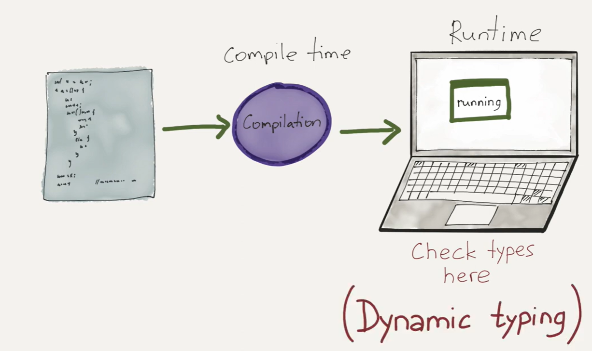
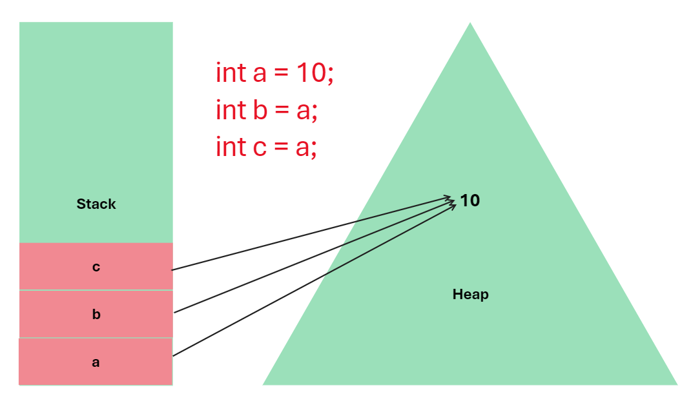
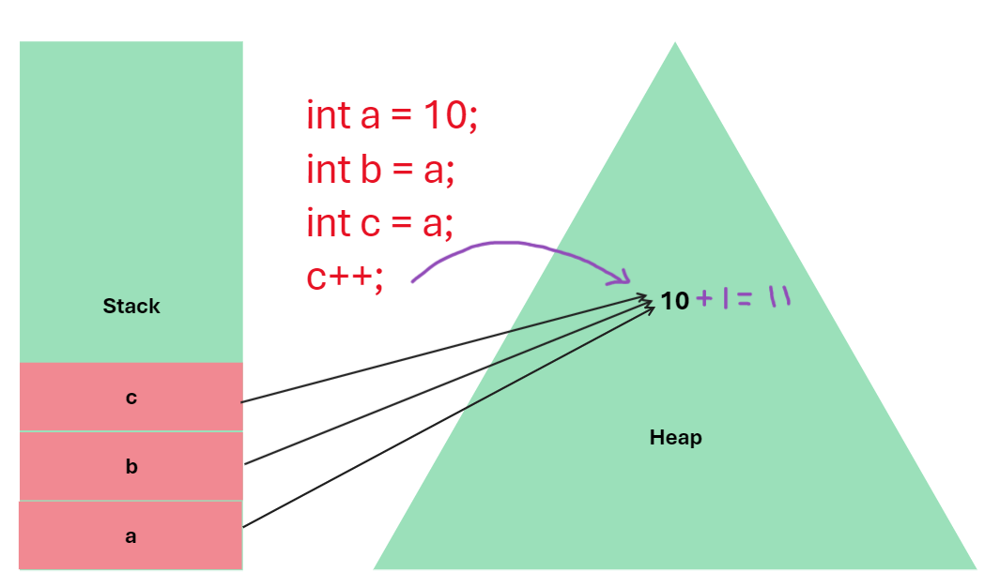

# Day 1: Introduction To Programming Languages & Memory Management

<h2>Types of Programming Languages </h2>
<h3>
1️⃣ Procedural Programming Language 
2️⃣ Functional Programming Language  
3️⃣ Object-Orieented Programming Language 
</h3>

<h2> ⭐ Procedural Programming Language </h2>
Procedural Languages are simple straight forward languages means here commands are written in simple and in well structured manner &  as per given commands the complete program runs in step by step manner.

In simple words this language contains systematic order of Statements , functions and commands to complete a specific task.

<h3>Procedural Programming Languages : </h3>
<b>C, C++, Python, Dart ,etc</b>

<h2> ⭐ Functional Programming Languages </h2>
Functional Programming is the pure function based programming means here all logical things are written in functions only.

Here functions not modify the variables data but instead they create new ones as output.Here variables are immutable.

Functional Programming is use in such condition when we have lots of data and we want to perform some operations on that data repeatetly. Ex. ML.

Here in this language First Class Functions are present First Class Functions are those functions here that can be intialise by different variables

means suppose here it is function of name "fun1" and it contains some block of code this fun1 is First Class Function if and only if we can intialise the other function by assigning this function logic to it
 
Ex. 
fun1(){} 
fun2 = fun1; 
so now fun2 have same logical code block so now both fun1 & fun2 can perform same operation 

<h3>Functional Programming Languages : </h3>
<b>Java, C++, Python, R, C# ,etc</b>

<h2> ⭐ Object-Oriented Programming Languages </h2>

Object Oriented programming is new and innovative way of programming it is completely depends on custom data type (class) and it's different properties

In OOP there is a "Class" which is known as custom data type and it's instance which is known as "Object" of that class the object of that class have access to all that variables & different methods present declare or initialise in Class

Example:
Let Suppose 
Humans is one of the class and it contains variables like 
 Eyes 👁️   Ears 👂  Nose 👃  and some functions like  Writing ✍️ Running 🏃 Thinking 🤔 & many more

And we all are objects of this class Human and we all are having all of this properties.

OOPs is develop to make easier to develop,debug,reuse and maintain the software

<h3>Object-Oriented Programming Languages : </h3>
<b>Java, C++, Python, JavaScript, TypeScript, C# ,etc</b>

 
 

<h1>Static Vs Dynamic Languages</h1>

<h3>⭐ Static Languages : </h3>
<ol>
<li>Perform Type Checking at Compile Time</li>
<li>Error will show at Compile time</li>
<li>Declare data type before we use it</li>
<li>More Control</li>
</ol>

Static Languages are those languages in which all error checking is only done at compile time.

Here any variable we create needs declaration it cannot identify the type of variable by checking it's value means here we first declare each and every variable before using it.

this language provide us more contol on our program here we cannot write incorrect code before running it we get to know where are the errors in program (code) except logical errors we can detect all errors in the code

 
 
<h3>⭐ Dynamic Languages</h3>
<ol>
<li>Perform Type checking at runtime</li>
<li>Error might not shown until program runs</li>
<li>No need to declare data types of variables</li>
<li>Save time at writing code but might give error at runtime</li>
</ol>

Here in dynamically typed language error checking is occured at runtime since here interpreter is present instead of compiler so it checkes the program line by line in runtime and continue executing those lines until it encounter error.

Here there is no need of declaring the data type of any variable before it's use since it automatically detects the type of variable by the value present in it. 

 

<h3>⭐ Strong & Weak Languages</h3>
Strongly typed languages are the those languages which are writen very seriously means here there is not any implicit conversions (direct conversion from one variable type to other one ) but they have explicit conversion methods (conversion via user) 

Weakly typed languages are support implicit conversion to display the output 
the best example of this is JavaScript which is weakly typed dynamic language

Example:

<h3>⭐ Static & Dynamic tells us when to check type</h3>
<h3>⭐ Strong & Weak tells us how seriously we check the type </h3>

<h2>Variables:</h2>
Variables are nothing but containers which are holding specific type of data in it.

When we declare any variable example : 
int a = 10;  
here a = Reference Variable & 10 is Object 

In Computer system there are 2 types of memory:
<h4>
1️⃣ Stack Memory 
2️⃣ Heap Memory</h4>

Stack memory is use to store the Reference variable and heap memory is use to store the object of reference variable.

In Java there is one thing is that if we assign multiple variables to the same value then instead of creating new copy each variable point a single object in heap.

And if one of the variable make changes in object and since all other variables are also pointing to same value then this changes also updated by them also.

