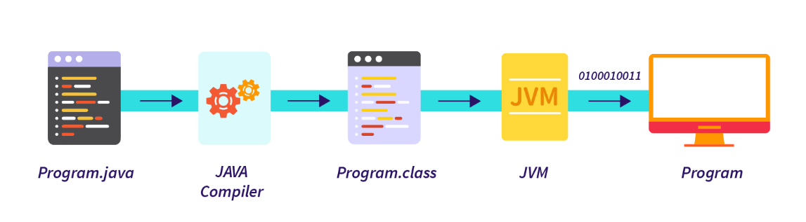
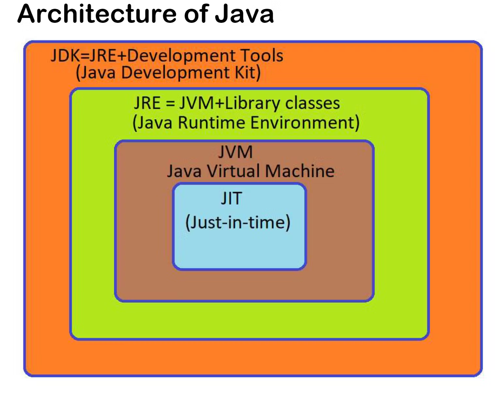
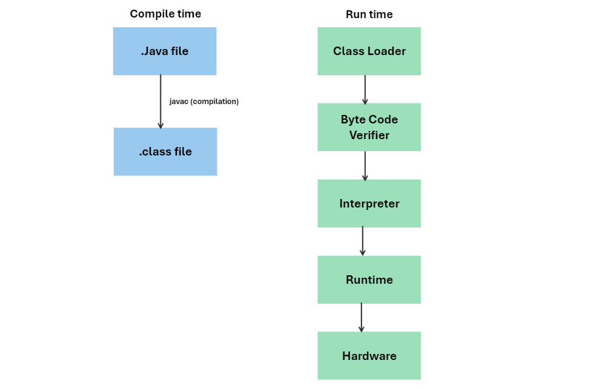
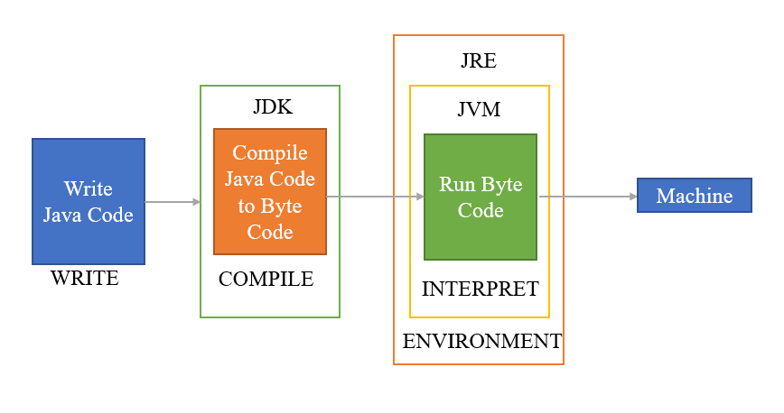

# Day 2: How Java Code Run

<h3>
1️⃣ Here first program.java (Java Source-Code) get compiled by Java Compiler and converted into byte-code & save as program.class file.
 
 
2️⃣ Byte code of this is nothing but byte format of Source code and this code can be run on any machine irrespective of it's parent machine (Platform Independent) by using JVM (Java Virtual Machine) this interprete the byte code line by line and runs it.
</h3>

 

<h2>Why Java is Platform Independent 🤔</h2>
<ul>
<li>The Byte code can run on any Operating System </li>
<li>In other languages like C,C++ the source code is directly converted into machince code using compiler and compiler is designed as per architechture of OS and due to this different OS have different Compiler versions or design</li>
<li>As different OS have different Compiler so there compiled file also be different</li>
<li> Suppose a file prog.c is C file compiled in windows and created a prog.exe file which execute in window OS but might not run on different machines like MAC,UBUNTU,LINUX etc</li>
<li>But in Java we get Byte Code which further get converted into executable file using JVM</li>
<li><b>Java is platform Independent but JVM is platform Dependent</b></li>
</ul>

<h2> Architecture of JAVA :</h2>

<h3>1️⃣ JDK (Java Development Kit)</h3>
<ol>
<li>provides the environment to develop and run the program</li>
<li>It is a Package that includes : 
<ul>
<li>Development Tools : To Provide healthy environment to run the program</li>
<li>JRE : To execute our program</li>
<li>a compiler : "javac"</li>
<li>archiver : "jar"</li>
<li>docs generator : "javadoc"</li>
<li>interpreter/loder</li>
</ul>
</li>
</ol>
 

<h3>2️⃣ JRE (Java Runtime Environment)</h3>
This is a package which only provide the environment to run the program 

It Consist of :
<ul>
<li>Deployment Technologies</li>
<li>User Interface ToolKit</li>
<li>Integration Libraries</li>
<li>Base Libraries</li>
<li>JVM</li>
</ul>

<h2> Working : </h2>

<h2>⭐ How JVM works:</h2>
<table border="3">
<tr>
<th>Loading</th>
<th>Linking</th>
<th>Initialization</th>
<th>Interpreter</th>
<th>JIT (Just-In-Time)</th>
</tr>
<tr>
<td>reads class file and generate binary data</td>
<td>JVM Verifies the .class file & allocates memory for class and default variables</td>
<td rowspan="2">all static variables are assigned with there values defined in the code and static block</td>
<td>Line by line execution</li>
<td>Those methods are repeatedly called for those methods JIT provides the machine codes once so there is no need to re-interpretation</td>
</tr>
<tr>
<td>An object of this class is created in heap</td>
<td>replace symbolic reference from the type with direct reference means replacing variable name with actual value of that variable in the program</td>
<td>When one method is called many times then it intereprete again and again</td>
<td>Makes Execution Faster</td>
</tr>
</table>

<h2> ⭐ Running A Java Code</h2>

