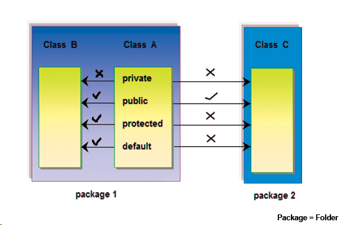
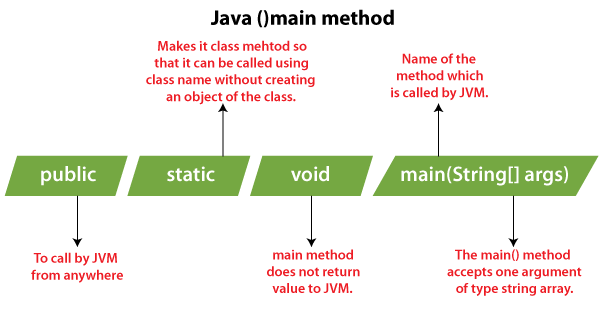
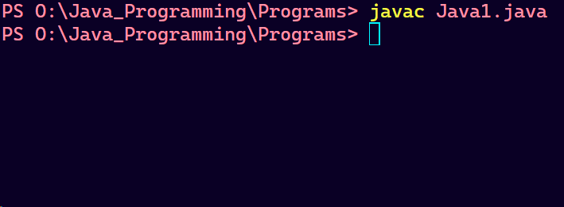
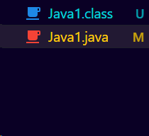
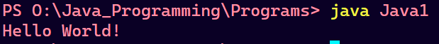
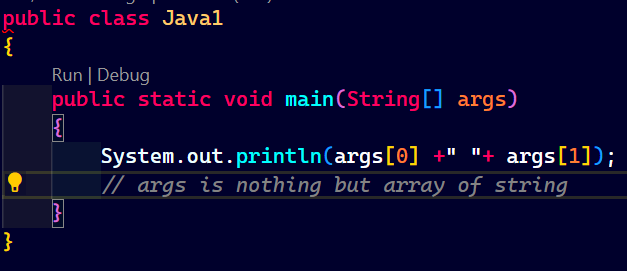
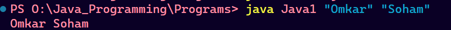
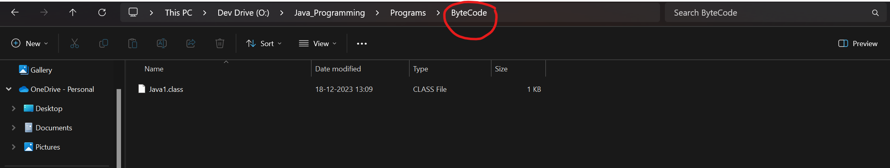
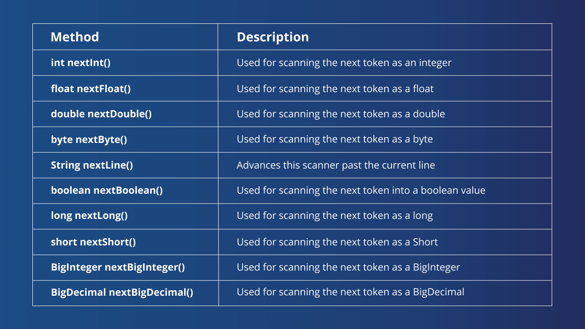
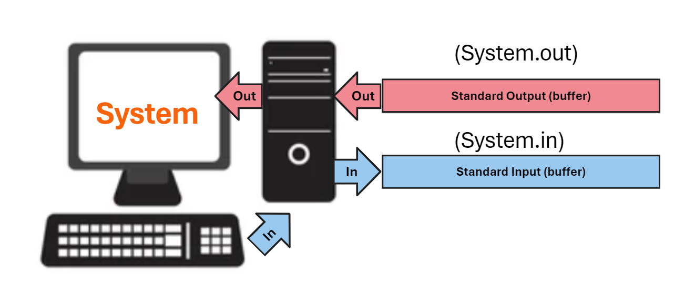

# Day 3 : First Java Program

<h2> 🌟 Step To Create Java Program</h2>
<ol>
<li>First create a folder and create our first javafile_name.java here ".java" is extension of java file.
</li>
<li> Now we create a class inside that java file <b>Every java file is nothing but a class</b> so while creating class the <b>name of the class must be same as name of the file.</b></li>

<li>First letter of class name is always be in the capital case (good practice).</li>

<li>Here after giving name we decide the scoup of the class (Where to access or where not) 
 There are 4 types of Access Modifiers :
<ul>
<li><b>Public</b> : We can access the public modifier from anywhere. We can access public modifiers from within the class as well as from outside the class and also within the package and outside the package.</li>
<li><b>Private</b> : We can access the private modifier only within the same class and not from outside the class.</li>
<li><b>Protected</b> : We can access the protected modifier within the same package and also from outside the package with the help of the child class. If we do not make the child class, we cannot access it from outside the package. So inheritance is a must for accessing it from outside the package.</li>
<li><b>Default</b> : We can access the default modifier only within the same package and not from outside the package. And also, if we do not specify any access modifier it will automatically consider it as default. </li>
</ul>

</li>
<li>After creating class create a main function in java

static functions are those functions of the class which can we run or execute without creating a new object of the class
</li>
<li>After creating a function write code to print "Hello World!" on the screen</li>
<li>Now it is time to convert .java file to .class file by compiling it using JRE (javac compiler) now we convert our java code into byte code format</li>
<li>For compiling java command <b>javac filename.java</b>
 
 

 
 

</li>
<li>Now we get the .class file which can be run on any other machine such that java is platform independent</li>
<li>Now we can run our first java class by entering command <b>java class_name</b>

</li>
<li>Command Line argument : The main function have string as argument which can be passed on command line only

</li>
<li>If we want to store the .class file or byte code to other destination use <b>javac -d destination filename.java</b>

</li>

<li>
<h3>System.out.println("Hello World!");</h3> 
Above line of code is use to print any string output on screen. Here system is class and println is the function in that class which perform printing operation where "out" is nothing but a standard output stream of system or in simpler word it is a output buffer of system.

So this print function print required output in output buffer
</li>

<li><h3>Scanner input = new Scanner(System.in);</h3>Above line of code is use to get any primitive data type input in java. Here "Scanner" is the class and "input" is new object of the scanner class. 

Here "System.in" represents the standard input stream of system where this function takes the inputed character here standard input stream is nothing but input buffer of the system</li>
 

