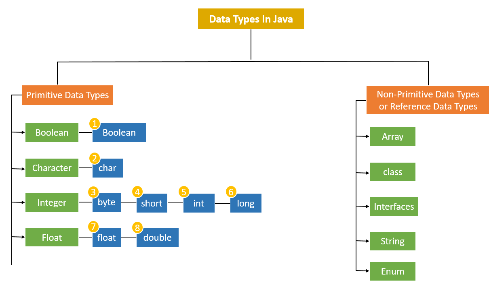
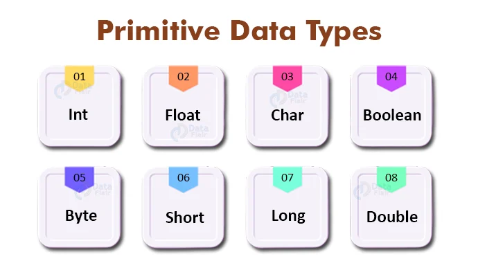
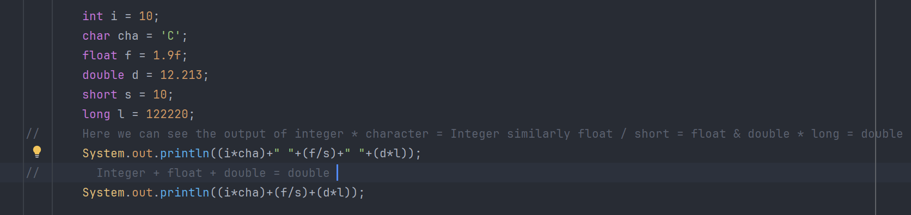
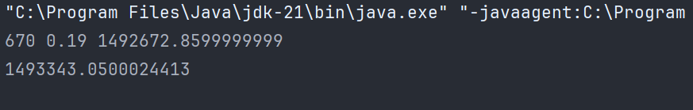
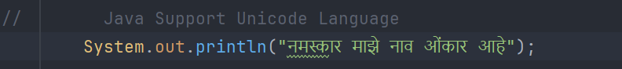
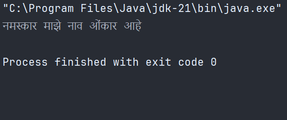

# Day 4 : Variables 

<marquee> ⭐ Follow Program :  Variables.java, Inputs.java & TypeCasting.java </marquee>

<h2>There are 2 different types of variables in Java </h2>
<h3>1️⃣ Primitive DataType<br>2️⃣ Non-Primitive/ Reference DataType</h3>




<h2>⭐ Primitive DataTypes</h2>
The datatype which cannot be further divided into simpler datatype those are known as Primitive or basic dataTypes

<br>



<h3>Example : </h3>

```
String name = "Omkar";
char Character = 'O';
```
here name is String which can be divided into single-single character (dataType) so it is not a Primitive but character 'O' cannot be further divided into simpler data types so it is known as Primitive DataType.

```
int number = 10;
char Charac = 'O';
float decimal = 10.23f;
double longDecimal = 1001212.212123;
long longnumber = 11001200102L;
short shortnumber = 21;
boolean check = true;
```

<h3> ⭐ Why we add "L" & "f" for long and float variable at end of value 🤔</h3> 
<p>Here for initialising float and long variables we required add "f" and "L" resp since all decimal numbers are by default double but if we want to store floating point number then we use "f" and all numbers first by default integer but if we want to store bigger integer then we want save it as Long & so we add "L" at last</p>


<br>
<br>
<hr>
<h2> ⭐ TypeCasting or Type Conversion</h2>
<h3>There are 2 types of TypeCasting or Conversion</h3>
<h3>1️⃣ Implicit Type Conversion<br>
2️⃣ Explicit Type Conversion</h3>
</h3>

<h3>Implicit Type Conversion : </h3>
<p>If one type of data asign to another type of variable and if certain conditions will mate then automatic type conversion occurs this type of type conversion is known as <b>Implicit Type conversion.

Conditions to be mate : </b>
<ul>
<li>Two types must be Compatible means If source datatype is integer then destination must be compatible like float,double,long etc but it never be a string.</li>
<li>Destination data type must be greater than or equal to Source data type.</li>
<li>
Byte,Short & char are directly Promoted to "Integer"</li>
<li>If any one of the variable in the operation is long/float/double then complete operation promoted into long/float/double</li>
<li>If we have multiple types in one expression then complete equation is converted into biggest datatype.



</li>
</ul>

<h3>Explicit Type Conversion : </h3>
<p>If the type conversion not happen implicitly and we wants to do that so by compressing the value of given variable we can convert the one variable type into another externally so this type of conversion is known as <b>Explicit type conversion</b>

<b>Float -> int</b>
```
int num = (int) input.nextFloat();
```

<b>double -> Byte</b>
```
byte num = (byte) input.nextDouble();
```


<h2> 🌟 Java support unicode values so that we can print any langauge sentences by it.</h2>





