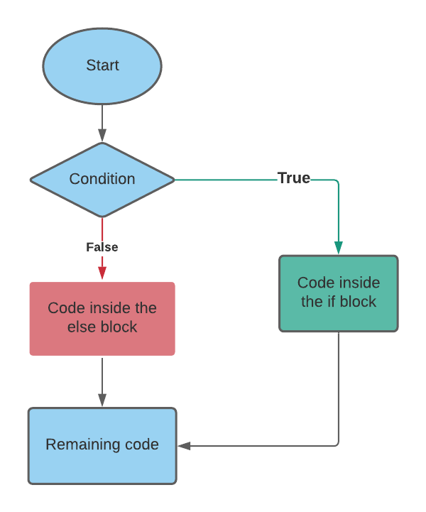
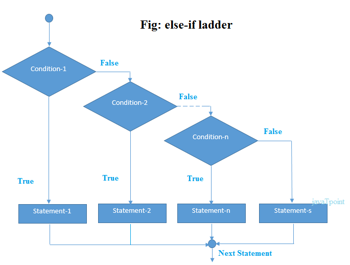

# Day 5 : Conditionals & Loops


<br>
<br>
<hr>
<h1>❓ Conditionals</h1>
<h2> 1️⃣ If-Else conditionals</h2>
<p>Use to deals with conditions this is responsible to make programs more efficient without conditionals programming is nothing</p>
<h3>Syntax : </h3>

```
if(Boolean Expression T or F)
        {
            // If true do this
        }
        else
        {
            // else do this
        }
```




<h2>2️⃣ If-Else Ladders</h2>
<p>if else ladder use when we want to deals with more than one condition & gives proper output</p>



<h3>Syntax</h3>

```

if(Boolean Expression T or F)
        {
            // If true do this
        }
        else if(condition 2)
        {
            // If this is true
        }
        else
        {
            // else do this
        }

```

<h3>⭐ Logical Operators like && and || are use to deals with multiple conditions </h3>

<h3>Suppose there are 2 conditions A & B</h3>
<p>If both conditions A & B are required to check then we use <b> && "AND Operator"</b> </p>

<p> If only one of two wants to check then use <b>|| "OR Operator"</b> </p>


<br>
<hr>
<h1> ➿ Loops</h1>
<p>Loops are use to perform a same operation multiple number of times till we get required output</p>

<h2>1️⃣ For - Loop</h2>
<h3>Syntax : </h3>

```
 for(initialisation , condition , increment/decrement)
        {
            body (Operation to be repeated)
        }
```

<h2>2️⃣ While - Loop</h2>
<h3>Syntax : </h3>

```
 while(condition)
        {
            body (Operation to be repeated)
        }
```

<h2>3️⃣ Do-While</h2>
<h3>Syntax : </h3>

```
        do
        {
            body (Operation to be repeated)
        }
        while(condition);
```


<h2> 💡Important : </h2>
<h3> 1️⃣ If we know exactly how many times we want to run a loop then we use <b>For Loop</b><br>
<br>
2️⃣ If we not know how many times we want to run a loop then use <b>While Loop</b><br>
<br>
3️⃣ Difference between while & do-while Loop is that do-while loop runs minimum once without checking the condition</h3>

<br>
<hr>
<h1> ⭐ Switch Statement</h1>
<p>Switch case is use if we want to check multiple possible values of specific variable instead of multiple if statements we use single switch in which we create number of different cases as per possible values.</p>

<h3>Syntax : </h3>

```
switch (variableName)
{
    case (value 1) : 
        operation;
        break;

    case (value 2) :
        operation;
        break;
        .
        .
        .
    case (value n) :
        operation;
        break;

    default:
        operation;
}
```
<br>
<hr>
<h2> 📝 Rules : </h2>
<ul>
<li>Cases are must be of save type as of Variable must be a constant or literal</li>
<li>Duplicate case values are not allowed </li>
<li>Break is use to terminate the sequence </li>
<li>If break is not used then it continue performing all operations in switch statement</li>
<li>Default case execute when none of the above case run</li>
<li>If default case is not at end put "break" after it</li>
</ul>
<br>
<hr>
<h2>Shorthand Method (enhanced switch)</h2>
<h3>Syntax :</h3>

```
switch (variableName)
{
    case (value 1) -> operation 1;
    case (value 2) -> operation 2;
    .
    .
    .
    case (value n) -> operation n;
    default -> default operation;
}
```

