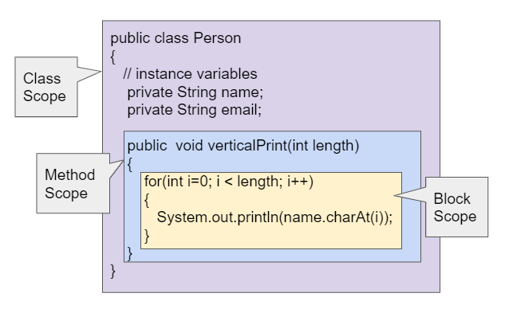

# Day 6 : Functions/Methods in java

<font size="4">

<ul>
<li>Functions defined in class are known as methods they are nothing but a function only.</li>

<li>Functions/methods are the block of code which can be use repeatedly for getting a specific output.</li>

<li>Functions are use to minimise the code space.</li>
</ul>

<h3>Syntax of Function : </h3>

```
access_modifier return_type function_name (arguments)
{
    \\ body
    \\ return value
}
```

<h3>Access Modifier : </h3>
<p>Access Modifier is nothing but a keyword which telling the compiler about the accessibility range of the given function</p>
<ol>
<li>Public</li>
<li>Private</li>
<li>Protected</li>
<li>Default</li>
</ol>

<h3>Return Type : </h3>
<p>Return type of any function define the value type which the function return after completing it's execution.</p>

<h3> ⭐Imp</h3>
<p>If you want to use any function in static function that function should be static one else it not working in it</p>

<h3>We can also pass the values of variable to the function so that the function work on those inputed value and give respected output and this values are nothing but <b>Argument</b></h3>

```
static int sum (int a,int b)
{
    return a+b;
}
```

<br>
<hr>
<h2>How Internally the function works when we pass value in it as a argument</h2>


Every value pass in the function is pointed by that argument in the heap 

Like in this example the first when we not actually changing the value wew pass the value of name to function at that time when we call that function the argument Naam also pointing to the same value in the heap.

But as soon as we try to change the value inside the function it automatically create new object with that changed value it not make change in initial one.

<h2>I java we only pass the argument by value only since java not have concept of pointer so it not support pass by reference like stuff</h2>

<h2> In Java the strings are immutable so we cannot change the value of string if both Naam & name pointing to the same object in heap but in change value function instead of modifiy the string we reassign it with different value so it create new object for that value.</h2>

<h3>1️⃣ Primitives Like Int,Char,Float,Double,Bool etc there value is pass only <br>
2️⃣ Object & Other reference variable Like String,Array etc there reference value pass to the function</h3>

<h3> ⭐ Primtives (Pass By Value)</h3>


<h3> ⭐ Reference Variable (Reference Value get copied )</h3>


When we use Reference variable then we can make change in the value of those reference variable using function.


<h1>⭐Variable Scope </h1>



<h3>There are 2 types of scope <br>1️⃣ Functional/Method Scope <br> 2️⃣ Block Scope</h3>

<h2>1️⃣ Functional/Method Scope : </h2>
<p>Variable Declare outside of any function cannot accessible inside the function & similarly the variables declare inside the function are only accessible inside the function we cannot accessible outside the function this type of variable are known as functional scope variables</p>

```
public class exm 
{
    public static void main()
        {
            int a = 10;
            fun(a);
            //here we cannot get value of "b" since variable  "b" is not in this scope
        }

    static void fun(int b)
        {
            b=b+1;
            //Here we cannot use value of "a" since a variable  is   out of scope
        }

//here we cannot get value of "b" since variable "b" is not in this scope

}
```

<h2>2️⃣ Block Scope</h2>
<p>Variable declare or initialise inside the main function this variable can be use and update/modify inside the block in same function. But we cannot redeclare the same variable inside the block.</p>

```
public class exm
{
    public static void main ()
    {
        int a = 10;

        //Block
        {
            int a = 12;// Here we cannot redeclare this variable since it is already created inside the main function

            a = 12; //But we can update/modify the value of variable 

            int b = 20;
        }

        b = 23; // Here we cannot use the variable "b" which we declare inside the block this variable is not accessible outside the block this is known as block scope variable.

    }
}
```

<h2>⭐Shadowing</h2>
<p>It is technique of overlapping a variable and overloading with some other variable with same name but different value all of this is depending upon scope</p>


<h3>Example : </h3>

```
package Programs;

public class Shadowing {

    static int x = 10; // this variable have global scope inside the class means it can be use anywhere inside the class

    public static void main(String[] args) {
        System.out.println("value of x = "+x);

        int x ; // here we declare a variable x inside the main function at this time variable with higher scope get shadowed due to shadowing means now this variable rules since this block have its scope
        x = 34;

        System.out.println("value of x = "+x); // use x = 34
        fun();
    }

    static void fun()
    {
        System.out.println("value of x = "+x); //use x=10 since x=34 is out of scope here
    }
}


```
<br>
<hr>
<h2> ⭐ Variable Length Argument</h2>
<p>We can pass variable number of arguments to the function using "..." this operator this allow us to pass any number of argument to the function but argument should be of same type this operator automatically convert this variables into array.</p>


```
package Programs.Functions;

import java.util.Arrays;

public class VariableLenArg {
    public static void main(String[] args) {
        fun(1,2,3,4,5,5,121,12,12,32,31,321,312,313,123,123,220,........);
    }
    static void fun(int ...arg)
    {
        System.out.println(Arrays.toString(arg));
    }
}


//Output : 
[1, 2, 3, 4, 5, 5, 121, 12, 12, 32, 31, 321, 312, 313, 123, 123, 220]


```

<h2>⭐ Function Overloading</h2>
<p>It is technique to create a function with same name but different operations are perform by both of them.</p>
<h3>Conditions of function overloading : </h3>
<h4>1️⃣ Both functions have different types of argument <br> 2️⃣ If both function have same argument type then number of argument pass to both function should be different.</h4>

<p>The compiler easily distinguish this function which are overload by observing argument type and it's count & Run all functions properly.</p>

<h3>Function Overloading with variable length arguments VarArg : </h3>

<p>
 here when we overload any function with variable length argument then we cannot run that function without putting a argument we cannot make argument null here because Ambiguity created since one line calling multiple functions at a time</p>


<h2>💪 ArmStrong Number </h2>
<p>An Armstrong number is a special kind of number in math. It's a number that equals the sum of its digits, each raised to a power. For example, if you have a number like 153, it's an Armstrong number because 1^3 + 5^3 + 3^3 equals 153.</p>


<h4>Program to Print ALL 3-Digit Armstrong Number</h4>

```
package Programs.Questions;


public class ArmstrongNum {
    public static void main(String[] args) {
        //Printing All 3-digit ArmStrong Number
        ThreeDigiArmStrong();
    }

    static void ThreeDigiArmStrong() {
        for(int i=100;i<=999;i++)
        {
            if(checkArmStrong(i))
            {
                System.out.println(i);
            }

        }
    }

    static boolean checkArmStrong(int num)
    {
        int sum=0;
        int res=0;
        int a =num;
        while(num!=0)
        {
            res = num%10;
            sum = sum + pwr(res,3);
            num=num/10;
        }

        if(sum==a)
        {
            return true;
        }
        else
        {
            return false;
        }

    }

    static int pwr(int base,int index)
    {
        int res=1;
        for(int i=1;i<=index;i++)
        {
            res=res*base;
        }
        return res;
    }

}


// Output
// 153 370 371 407

```


