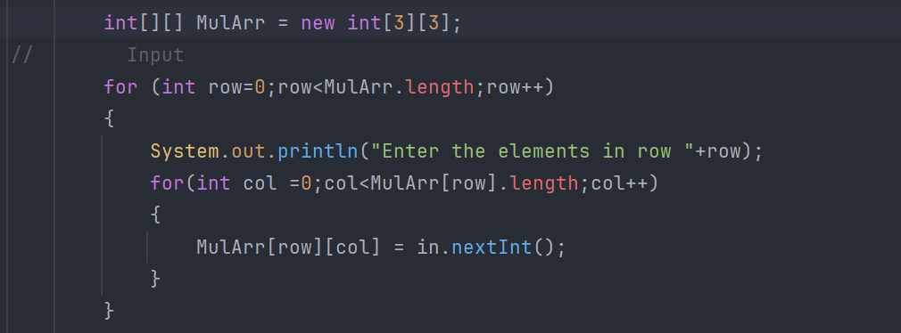

# Day 7 Arrays & ArrayList

<p>Array is nothing but a data structure which can store multiple values of same datatype</p>

<h3>Syntax of array Declaration </h3>

```
// datatype[] array_name = new datatype[size];
int[] Roll_no = new int[5];

```


```
//        Declaration
        int[] roll = new int[10];
//        Initialisation
        int[] Roll = {1,2,3,4};
```

* Datatype - It denotes the what datatype elements are present in array 

* We cannot put multiple datatype element inside a single array

* When we declare any array at that time it created into stack memory.But when we actually initialise by using "new" key word at that time actual object of array is created into the heap

* "new" Keyword is use to create Object

* when we create any array at first all array element are set to "0" or initialise to "0" for integer array and for string array it set to "null"


<h3>💡Imp</h3>
* In java array the elements store inside it are store in continuous memory location because of JVM.

* JVM have stack & heap as memory element so when we declare any array Reference variable is created inside a stack of JVM not in stack of OS and also when we initialise it Object of array get store inside JVM Heap not in computer memory so here array data is store dynamically since heap storage system of JVM store data dynamically.

* So array elements in java not store in continuous memory locations.


<h3>Input & Output in array </h3>

<p>Using For-Loop</p>


<p>Using ForEach-Loop</p>


** We cannot Take Input in array using for-each loop **

<h3>Arrays.toString() this function help us to convert the array into string and print as a String only</h3>


<h2> Multi-Dimentional Array</h2>
multidimentional array is nothing but array of arrays

<h3>Syntax : </h3>

```
// datatype[][] array_name = new datatype[No.of.rows][No.of cols];
```
<h4>💡 There is no need to specify No.of.cols </h4>

```

int[][] arr2D = new int[3][];

int[][] Mularray = {
    {1,2,3},
    {4,5,6},
    {7,8,9}
}

```


<h3> ⭐ Here columns have no significance</h3>

<h3> 📏 length function</h3>
Here Array_name.length function tells us number of rows in multidimentsional array in simpler terms it telling about number of arrays inside the multidimensional array 
<br>
<br>


<h3>Input & Output in Multidimensional Array</h3>
<h3>Input : </h3>



<h3>Output : </h3>

<p>Using Simple For Loop</h3>


<p>Using one for loop and Arrays.toString() function</p>


<p>Using One for-each Loop and Arrays.toString() function</p>


<p>When we apply Arrays.toString(Multidimensional Array) it returns the string containing reference variable present inside the multidimensional array</p>

<br>
<br>
<hr>
<h2>🎞️ ArrayList</h2>
<p>ArrayList is one of the data structure similar like array but it's important property is that it handle the size of array means here while declaring ArrayList we need not require to specify size of it.
</p>
<p>It is Just similar like "vectors" in C++</p>
<p>ArrayList is one of the part of collection frameworks in Java</p>

<h3>Syntax : </h3>

```

// ArrayList <Wrapper Class of datatype> nameOfList = new ArrayList<>(initialCapacity);

ArrayList<Integer> list = new ArrayList<>(10);
//Here 10 is the initialCapacity 

```

<h3>TO add elements in list we have .add() function which add elements in list</h3>

```
ArrayList<Integer> list = new ArrayList<>(10);
list.add(1);
list.add(2);
list.add(3);
list.add(4);
list.add(5);
```

<h3>To print the list we directly use list name to print, Easy!</h3>

```
System.out.println(list); // [1,2,3,4,5]
```

<a href="https://www.geeksforgeeks.org/arraylist-in-java/" target="black"  >Explore more methods of ArrayList Object</a>

<h2> ⚙️Internal Working of ArrayList</h2>
<p>ArrayList Is working is as same as array but one difference is in variable length property of ArrayList </p>

<p>ArrayList not having infinite amount of space Arraylist != Array[♾️] </p>

<p>Here first array created into the heap of size = initialCapacity But as the given array is filled half the new array of double size is created and all elements in previous array get copied inside the new array and this occurs continuously so due to this we fill that ArrayList Have infinite length</p>

<p>ArrayList provide space if & only if when there is a space in memory</p>


<h2>⭐ MultiDimensional ArrayList</h2>
<p>It is nothing but extended version of multidimensional array it nothing but a multidimensional array but with extra feature of ArrayList</p>

<p>It is nothing but ArrayList of ArrayLists</p>

<h3>Syntax : </h3>

```
ArrayList<ArrayList<Integer>> list = new ArrayList<>(5);
```


