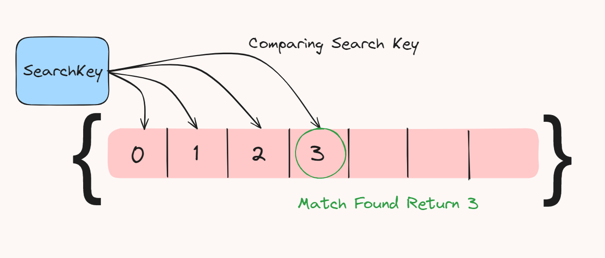
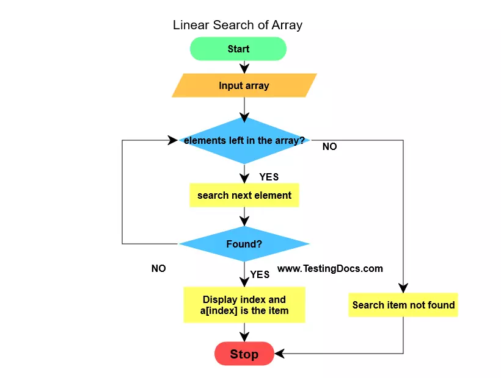

# Day 8 Linear_Search

<p>Linear Search is one of the basic searching algorithm to search any element in the array</p>

<p>Here we take <b> searchKey</b> (element which we want to search in given array) from user as a Input.</p>

<p>After taking searchKey as Input we iterate the given array and check whether searchKey matches any element of given array.</p>

<p>If it matches we return the index of that matched element in the array</p>

<p>Else return -1 (denotes that the searchKey Not present in given Array)</p>



<h2> 🗒️ Algorithm</h2>



<h2> 🧑‍💻 Code</h2>

```
public class BasicLinearSearch {
    public static void main(String[] args) {
        Scanner in = new Scanner(System.in);
        int[] arr = {5,21,23,123,2,153};
        System.out.print("Enter the number which you wants to search : ");
        int searchKey = in.nextInt();
        int index = linearSearch(arr,searchKey);
        if(index>=0)
        {
            System.out.println("SearchKey Present at index : "+index);
        }
        else
        {
            System.out.println("SearchKey is Not Present in Given Array ");
        }


    }

    static int linearSearch(int[] arr, int searchKey) {
        if(arr.length==0)
        {
            //if array size is 0 return -1
            return -1;
        }
        
        for(int index=0;index<arr.length;index++)
        {
            if(arr[index]==searchKey)
            {
                // If Number found return Index
                return index;
            }
        }

        //if Number Not found return -1
        return -1;
    }
}

```


