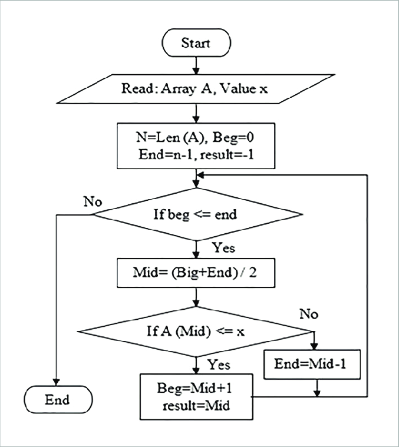
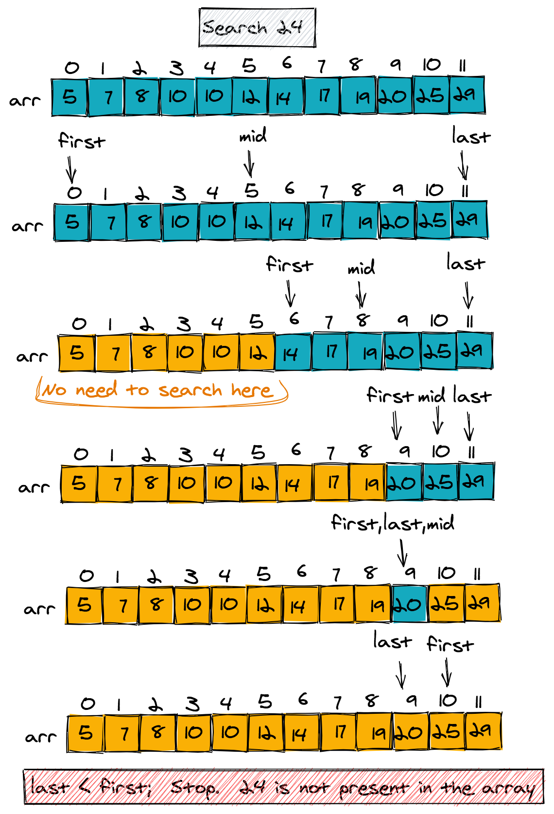
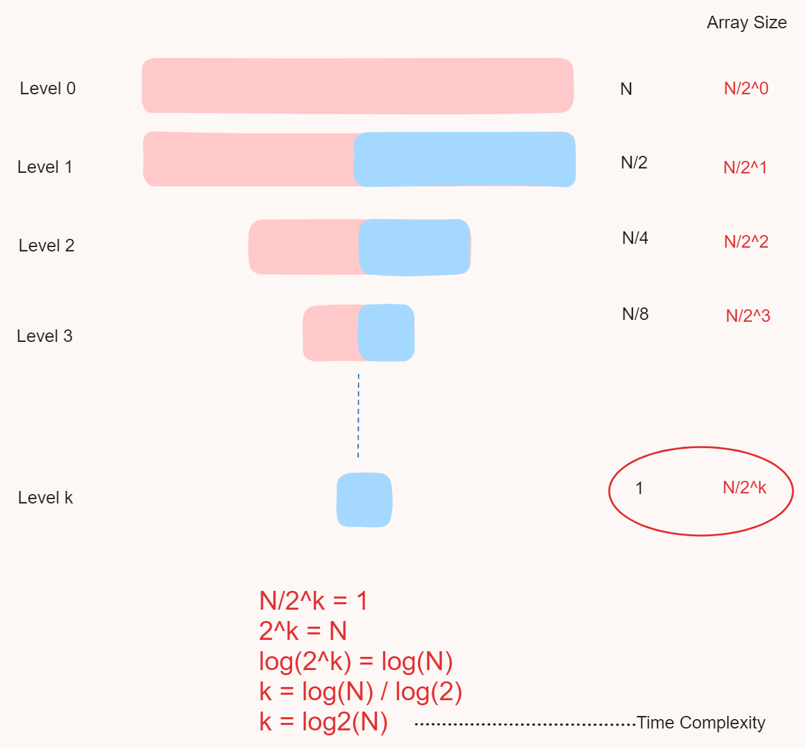
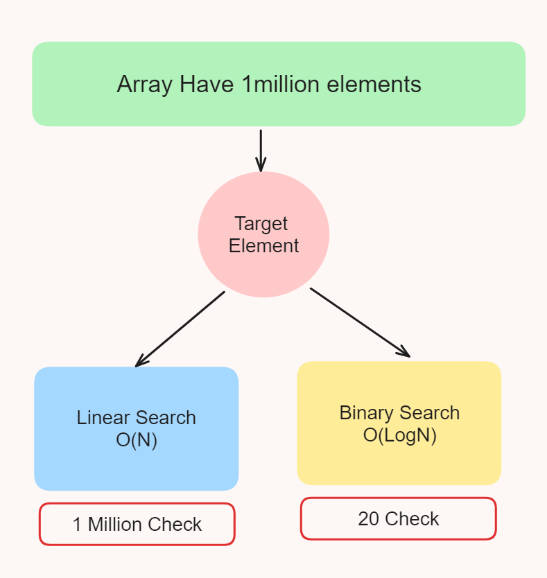
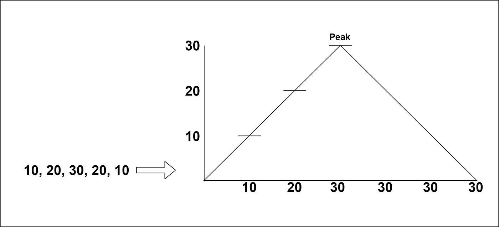
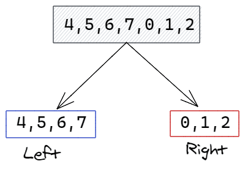

# Day 9 Binary_Search

<p>This is one of the Searching Algorithm or one of the best Searching Algo it is applied on sorted array to search any targeted element</p>

 <h3>What is Need of Binary Search :  </h3>
 <p>Linear Search have worst case time complexity is O(n)</p>
 <p>So it not a optimised searching algorithm so binary search is try to make searching algorithm optimised</p>

<h2>⚙️ Algorithm</h2>

<h3> Algo for Asendingly sorted array!</h3>

<p>Here we Use <b>Two Pointer Method</b> like start & end first initialise start pointer as "0" and end pointer as "arr.length-1"</p>

```
int start = 0;
int end = arr.length;
```

<p>After that find mid by using start and mid pointer <b> mid = (start+end)/2</b>

But if some time there is large sized array so if we add start & end so we get such value which is out of range of integer datatype so to avoid this we use optimised equation <b>mid = start +(end-start)/2</b></p>

```
mid = start +(end-start)/2;
```

<p>Now Create a while loop and run this loop till start<=end <p>

```
while(start<=end) 
{

}
```

<p>Now inside the loop check whether the <b>arr[mid] == target </b> element or not</p>

<p>
<ol>
<li>If <b>target==arr[mid]</b> then break the loop and print the mid</li> 

<li>If <b>target < arr[mid]</b> then set <b>end = mid-1</b></li>
<li>If <b>target > arr[mid]</b> then set <b>start = mid+1</b></li>
</ol>

<b>And Done!</b>

<h3> 🌟 If array is Desendingly Sorted </h3>
<p>
<ol>
<li>If <b>target==arr[mid]</b> then break the loop and print the mid</li> 

<li>If <b>target < arr[mid]</b> then set <b>start = mid+1</b></li>
<li>If <b>target > arr[mid]</b> then set <b>end = mid-1</b></li>
</ol>
</p>






<h2> 🕥 TimeComplexity </h2>



<h3>Compare Linear Search with Binary Search Algo</h3>
<p>Linear Search algo have Worst Case Time Complexity = <b>O(N)</b></p>
<p>Binary Search algo have worst case Time Complexity = <b>O(log(N))</b></p>



<h3> 😄 Due to this Binary Search is best searching algorithm except others</h3>


<h1>Bitonic Array</h1>
<h2>Peak Element Algo : </h2>



<ol>
<li>Initialize two pointers, start and end, to the start and end of the array respectively.</li>

<li>Enter a loop that continues until start is less than end.</li>
<li>Calculate the middle index mid as start + (end-start)/2.</li>
<li>Check if the element at mid is greater than the element at mid+1. If it is, set end to mid.</li>
<li>If the element at mid is not greater than the element at mid+1, check if mid is not the first or last element and if the element at mid-1 is greater than the element at mid+1. If these conditions are met, set end to mid.</li>
<li>If neither of the above conditions are met, set start to mid+1.</li>
<li>Repeat the loop until start is not less than end.</li>
<li>Return start as the index of the peak element.</li>

```
    static int peakelement(int[] arr) {
        int start =0;
        int end=arr.length-1;
        int mid=0;
        while(start<end)
        {
            mid = start + (end-start)/2;
            if(arr[mid]>arr[mid+1])
            {
                end=mid;
            }
            else if(mid!=0 && mid!=arr.length && arr[mid-1]>arr[mid+1])
            {
                end=mid;
            }
            else {
                start = mid+1;
            }
        }
        return start;
    }
```


<h2>Pivot Element Algo</h2>


<p>Here 7 is the pivot </p>

