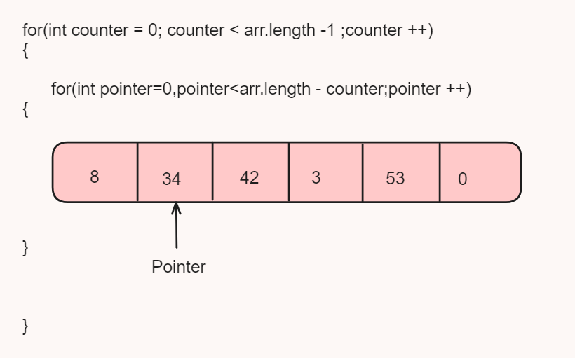
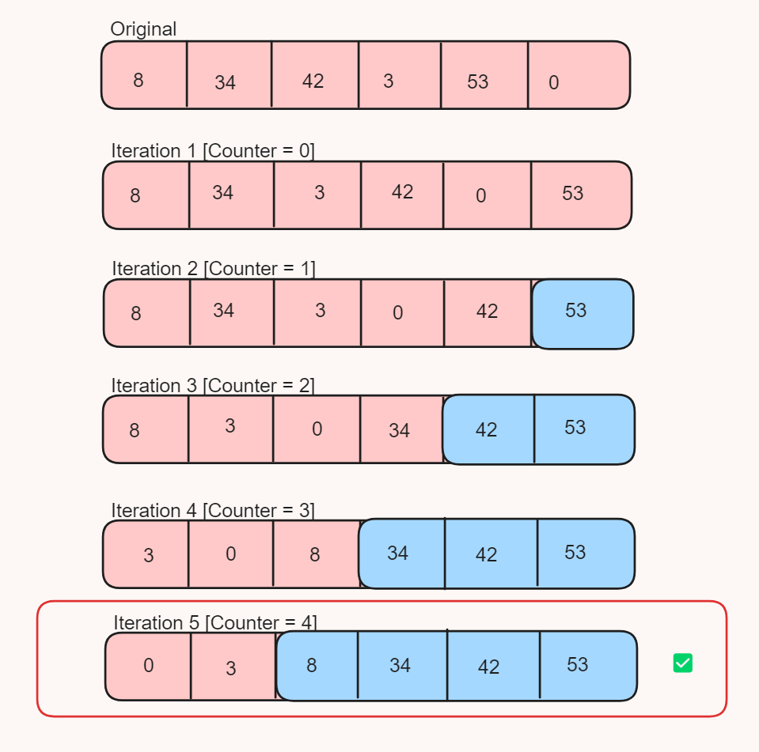
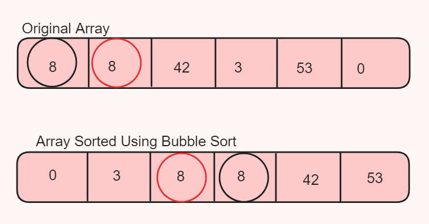

# Day 10 : Bubble Sort

<p>Bubble Sort is one of the basic Sorting Technique which we implement to sort mostly arrays and other data structures also</p>

<p>In bubble sort we take 1 pointer and one Counter and iterate them using for-loop over the given array</p>

<p>Counter checks wethear inside loop not runs more than array length times</p>

<p>Pointer is use to check wethear previous element is less than (asending sort) or greater than (desending sort) if it is lesser than current element (asending) we not swap but if it is greater than current we swap both position using Swap function</p>

<p>Each iteration of inner loop on array give the biggest element it's actual place in sorted array</p>

<p>So as number of iterations perform the given array get sorted from end </p>

<p>Due to this we only perform inside loop iteration only (Array length - counter) times only because last element of given array already get there actual position </p>





<h2>Algorithm </h2>

<ol>
<li>
Start with an unsorted array.</li>
<li>Begin a loop that will iterate over the array from the first element to the second last</li> element. <li>Let's call this index i.</li>
<li>For each i, start another loop from the second element to the n-ith element of the array.</li> <li>Let's call this index j. n is the length of the array.</li>
<li>Inside the inner loop, compare the j-1th element with the jth element. </li><li>If the j-1th element is greater than the jth element, swap them.</li>
<li>Keep a counter c to track if any swaps were made during the inner loop. If c remains 0 after the inner loop, it means the array is already sorted and we can break the outer loop.</li>
<li>Reset the counter c to 0 at the end of each outer loop iteration.</li>
<li>Repeat steps 2-6 for each value of i.</li>
<li>After all iterations, the array will be sorted in ascending order.</li>


</ol>

<h2>Code </h2>

```
static void bubbleSort(int[] arr) {
        int c = 0;
        for(int i=0;i<arr.length-1;i++)
        {
            for(int j=1;j<arr.length-i;j++)
            {
                if(arr[j-1]>arr[j])
                {
                    arr[j-1] = arr[j-1] * arr[j];
                    arr[j] = arr[j-1] / arr[j];
                    arr[j-1] = arr[j-1] / arr[j];
                    c++;
                }
            }
            if(c==0)
            {
                break;
            }
            else {
                c = 0;
            }
        }
    }
```

<h2>⏱️Time Complexity </h2>
<h3>Best Case Time-Complexity : O(N) => This is happens when our array is already sorted </h3>
<h3>Worst Case Time-Complexity : O(N^2) => This is happens when our array is in desending order and we want to sort it in ascending order</h3>

<h2>📦 Space Complexity</h2>
<p>Space Complexity of Bubble sort is O(1) Constant we sort the given array without creating the new array</p>

<h3> 🌟 The Bubble sort is Unstable sorting algorithm </h3>
<h3>Unstable Sorting Algorithm : </h3>
<p>Here order of same elements in non sorted array not remains same in sorted array</p>



<p>Here in original array the red ball of 8 is present after black ball but after sorting by bubble sort this order is not maintained</p>


