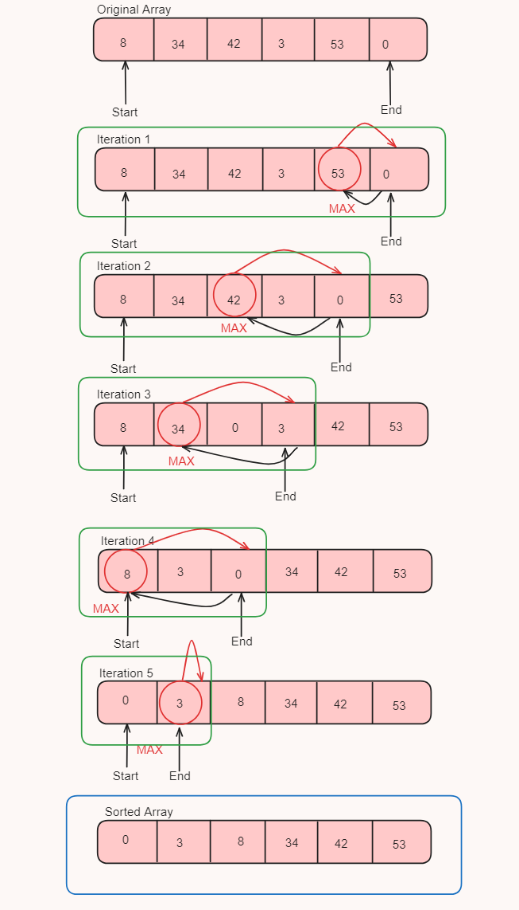

# Day_11 Selection Sort

<p>Selection sort is also one of the sorting algorithm specifically use to sort array and also be use to sort other data structures but it's best use case to sort small lists</p>

<p>Selection sort is bit different than bubble sort because here we first select range of array which is unsorted using the start and end pointers and in unsorted array we find or select the maximum element and swap that element with the last index of the unsorted array and decrement the end pointer</p>

<p>Here if we select smallest element then we want to swap with start element of the unsorted array and increment the start pointer</p>

<p>And here we compare elements till 1st element only means minimum unsorted array size is 2</p>



<h2> 💻 Algorithm</h2>
<ol>

<li>Start with an unsorted array.</li>
<li>Begin a loop that will iterate over the array from the last element to the second element. Let's call this index end.</li>
<li>For each end, find the index of the maximum value in the array from the first element to the endth element. Let's call this index maxIndex.</li>
<li>Swap the endth element with the maxIndexth element.</li>
<li>Decrease end by 1.</li>
<li>Repeat steps 3-5 for each value of end.</li>
<li>After all iterations, the array will be sorted in ascending order.</li>

</ol>

<h2>Code</h2>

```
static void selectionSort(int[] arr)
    {
        int end = arr.length-1;
        while (end>1)
        {
            swap(arr,end,maxvalInd(arr,0,end));
            end--;
        }
    }

    static void swap(int[] arr, int end, int i) {
        int temp = arr[end];
        arr[end] = arr[i];
        arr[i] = temp;
    }

    static int maxvalInd(int[] arr, int i, int end) {
        int max = 0;
        for(int j =i;j<=end;j++)
        {
            if(arr[j]>arr[max])
            {
                max = j;

            }
        }

        return max;
    }
```


<h2> ⏱️Time Complexity</h2>
<h3>Best Case Time Complexity : O(N) => (If array Already Sorted)</h3>

<h3>Worst Case Time-Complexity : O(N^2) => This is happens when our array is in desending order and we want to sort it in ascending order</h3>


<h2>📦 Space Complexity</h2>
<p>Space Complexity of Bubble sort is O(1) Constant we sort the given array without creating the new array</p>


