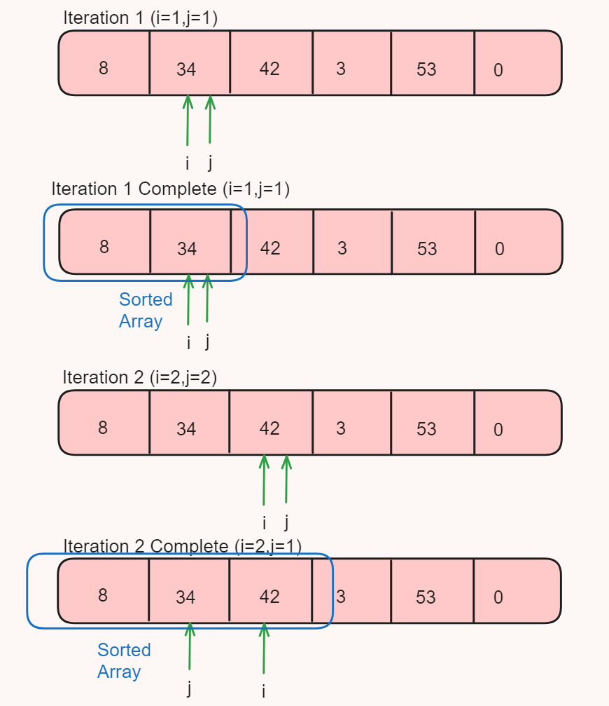
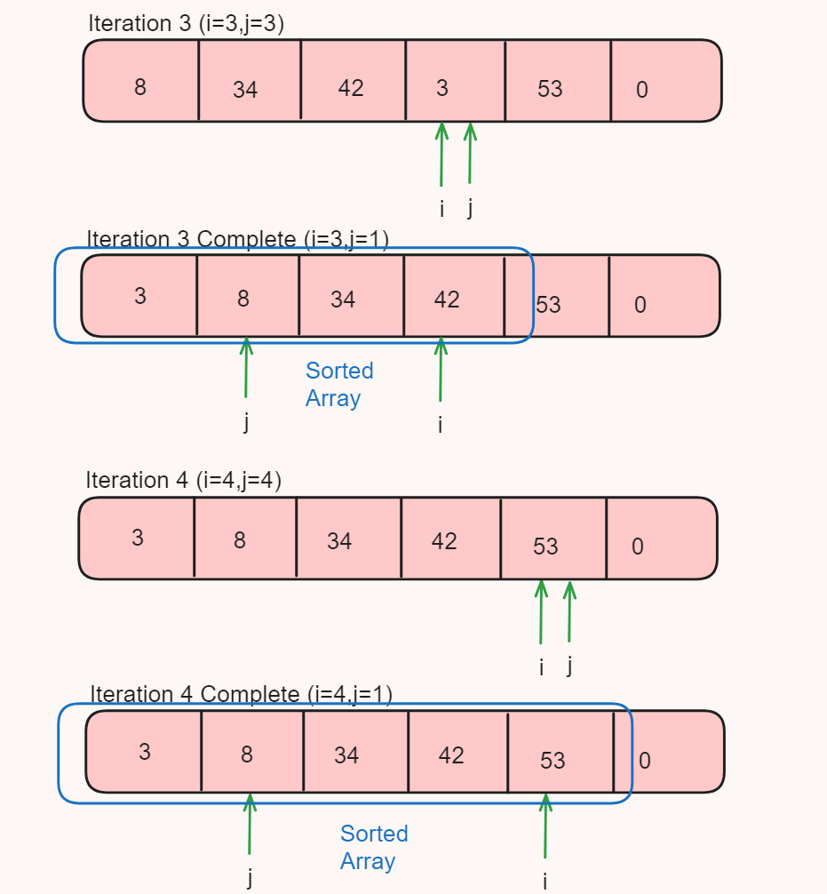
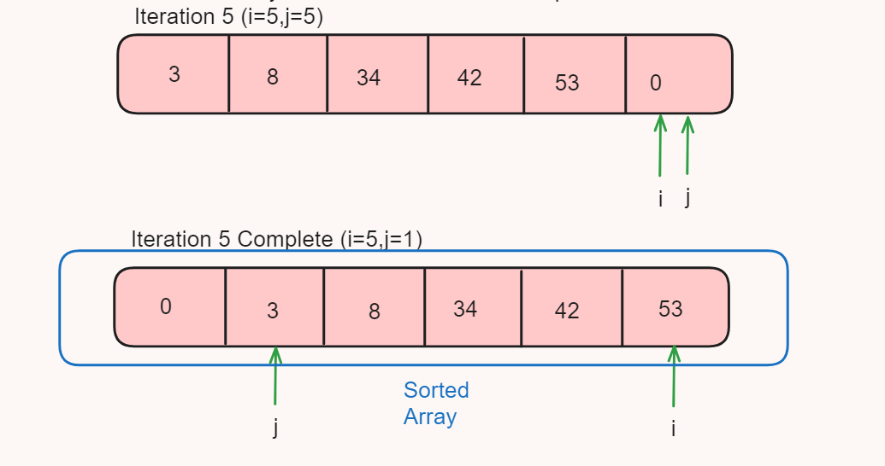

# Day_12 Insertion Sort

<p>Insertion sort is also one of the sorting technique which is use to sort arrays or any other data Structures</p>

<p>Insertion sort is way different than selection as well as bubble sort algorithm</p>

<p>Here in insertion sorting takes place in step by step manner means here we divide our given array into two parts and one part of it is always sorted and that part length also increases till size of array</p>

<p>Means here we sort our array by sorting multiple unsorted sub array of that given array</p>





<h2> 💻 Algorithm</h2>
<ol>
<li>Start with an unsorted array.</li>
<li>Begin a loop that will iterate over the array from the second element to the last element. Let's call this index i.</li>
<li>For each i, start another loop that goes from i to the first element of the array. Let's call this index j.</li>
<li>Inside the inner loop, compare the jth element with the j-1th element. If the jth element is less than the j-1th element, swap them.</li>
<li>But if the jth element is Not less than the j-1th element,we need to break the inner loops since the chunk of array is already sorted</li>
<li>Continue this process until the inner loop has gone through all the elements for the current value of i.</li>
<li>Repeat steps 3-5 for each value of i.</li>
<li>After all iterations, the array will be sorted in ascending order.</li>
</ol>


<h2> Code </h2>

```
  static void insertionSort(int[] arr) {

        for(int i = 1;i<arr.length;i++)
        {
            for(int j =i;j>0;j--)
            {
                if(arr[j]<arr[j-1])
                {
                    swap(arr,j,j-1);
                }
                else
                {
                    break;
                }
            }
        }
    }

    static void swap(int[] arr, int end, int i) {
        int temp = arr[end];
        arr[end] = arr[i];
        arr[i] = temp;
    }
```

<h2> ⏱️Time Complexity</h2>
<h3>Best Case Time Complexity : O(N) => (If array Already Sorted)</h3>

<h3>Worst Case Time-Complexity : O(N^2) => This is happens when our array is in desending order and we want to sort it in ascending order</h3>


<h2>📦 Space Complexity</h2>
<p>Space Complexity of Bubble sort is O(1) Constant we sort the given array without creating the new array</p>

<h2> 🌟 Features of Insertion Sort</h2>
<ol>
<li> Steps get Reduce when array is already sorted </li>
<li> Less number of time Swapping occurs as compare to Bubble Sort</li>
<li> It is a Stable Sorting algorithm</li>
<li> Use for smaller arrays & work best in the condition when array contains multiple small small sorted array</li>
<li> Insertion sort is also use in hybrid sorting algorithm with merge & quick sort</li>

</ol>
<p> Hybrid Sorting algorithm are those algorithm in which some other sorting algorithms are use in such a way that they all work together and sort the array in very efficient manner for particular condition</p>


