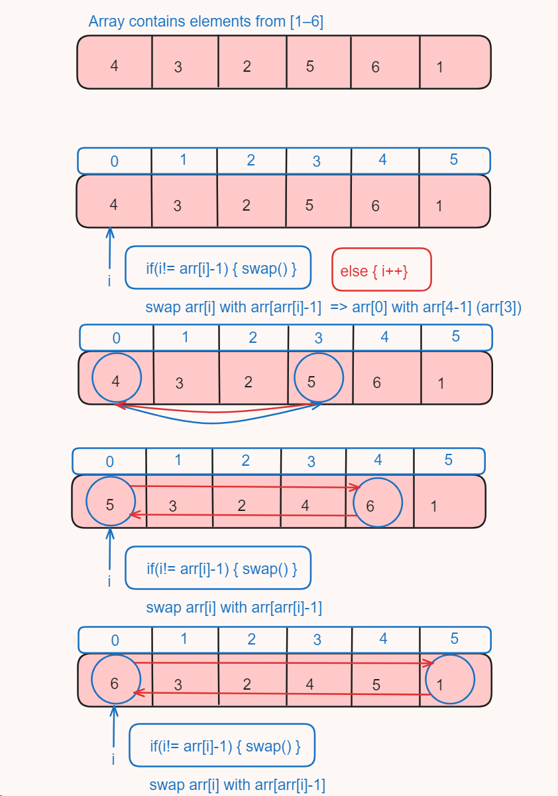
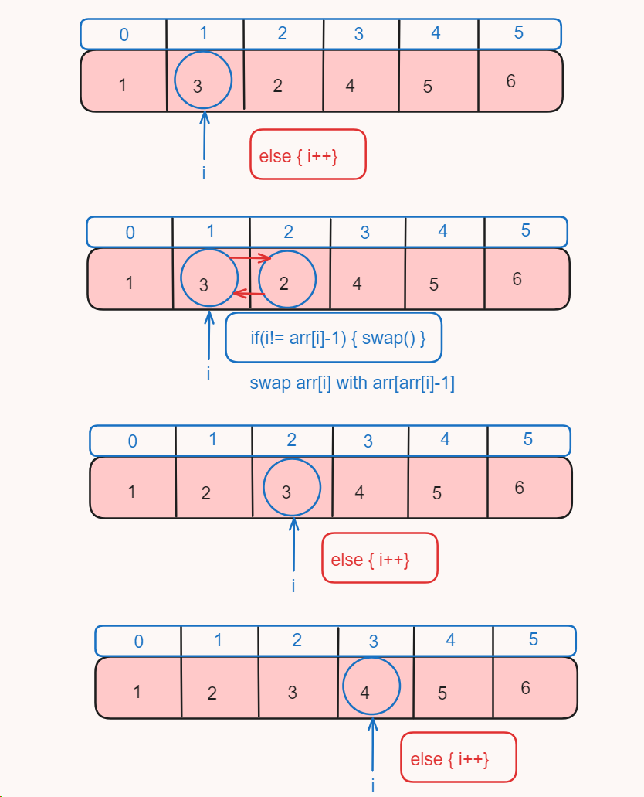
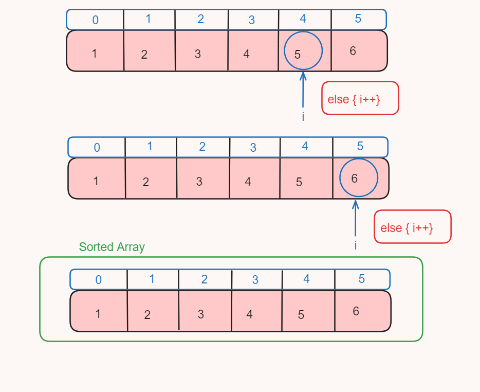

# Day_13 Cyclic Sort

<p>The cyclic sort is the on of the type of sorting algorithm use to sort specific pattern of array in O[n] time Complexity so it is one of the efficient algo to sort array containing numbers from 1-N</p>

<p>Here pattern of numbers are such that array consist elements or number from 1-N where "N" will be any integer value but no number is repeated and no number is skiped or added which is out of range of 1-N</p>

<p>Sorting of elements are done using indices of array (ind) there is equation which is use to sort the entire array</p>

<p>Let suppose "arr" be the array which consists elements from [1-N] 
so if we sort it in ascending order 
then 

1 is present at index 0<br>
2 is present at index 1<br>
3 is present at index 2<br>
. . . . <br>
. . . . <br>
n is present at index (n-1)</br>

So using [ index = n - 1 ] where n is any element in the array 
</p>





<h2> 💻 Algorithm</h2>
<ol>

<li>Start with an unsorted array where the elements are integers from 1 to n (where n is the length of the array).</li>
<li>Initialize a pointer i at the start of the array.</li>
<li>Enter a loop that continues until i is less than the length of the array.</li>
<li>Inside the loop, check if the ith element is at its correct position (i.e., if it's equal to i+1). If it is, increment i by 1.</li>
<li>If the ith element is not at its correct position, swap it with the element at its correct position (which is arr[i]-1).</li>
<li>Repeat the loop until i is not less than the length of the array.</li>

</ol>

<h2> Code</h2>

```
  static void sort(int[] arr) {
        int i=0;
        while(i<arr.length)
        {
            if((arr[i]-1)!=i)
            {
                swap(arr,i,arr[i]-1);
            }
            else
            {
                i++;
            }
        }
    }

    static void swap(int[] arr,int s,int e)
    {
        arr[s] = arr[s] * arr[e];
        arr[e] = arr[s] / arr[e];
        arr[s] = arr[s] / arr[e];
    }
```

<h2> ⏱️Time Complexity</h2>
<p>Time complexity of cyclic sort is O[n] which is the best feature of cyclic sort algorithm</p>


