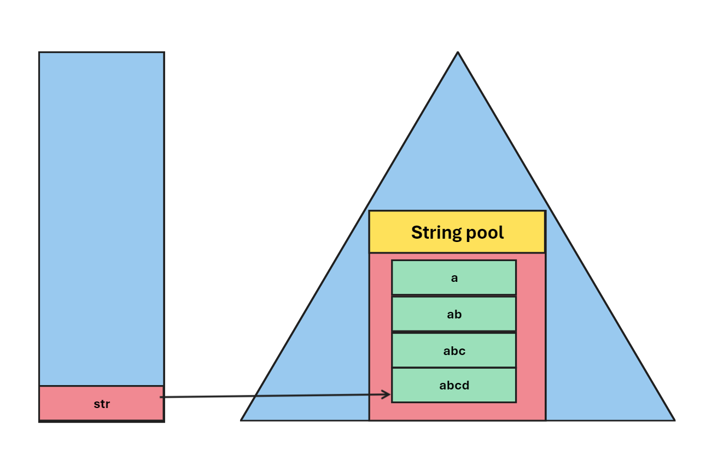

# Day_14 Strings In Java

<p>String data structure is the collection of characters.</p>

<p>In java Strings are refer as data type, There is String class is present to create a String Object</p>

<p>Here in Java New Created String Object get store into String Pool which is present inside the heap</p>

<p>String Pool : It is special type of structure which is present inside Heap & use to store string objects inside it</p>

<p>String Pool have some property like it do not allow to store objects with same value and if the objects have same value then both objects reference variable points the same object (string) inside the String pool </p>


<p>Now lets check wethear A & B Points to same object in String Pool or not</p>

<p>Using "==" operator "==" operator checks is the objects of referece variable are same or not</p>

```
public class BasicsStrings {
    public static void main(String[] args) {
        String a = "Omkar";
        String b = "Omkar";
        System.out.println(a==b); // true
        
    }
}
```

<p>Here this behavoir of String is same as Array (reference Variable) when we equalise the reference variable of Array with other array variable then both reference variable start pointing to the same object only</p>

<p>But in array if we change the value of object using any one reference variable then this change is reflected to the other reference variable objects since they are pointing to the same object in heap</p>

<p>But in case of String this is different since strings are store inside String Pool So String are not allowed to modify once it's object is created</p>

<p>So because of some security related feature Java Strings are Immutable</p>


<p>Here in below example we created a String of name "A" and give a value as "Omkar" But now we reassign the value of string as "Om" but this is not a immutability here we not making any change in the original string "Omkar" we are creating the new object with value as "Om" so new Object is directly created inside the String Pool</p>

<p>And this is valide 💯</p>


```

public static void main(String[] args) {
        String a = "Omkar";
        System.out.println(a);  // Omkar
        a = "Om";
        System.out.println(a);  // Om

    }

```

<p>Now We are explicitly create a object with same value and then check is the both objects pointed by the 2 different reference variables are different or not</p>


```

public static void main(String[] args) {
        String a = new String("Omkar");
        String b = new String("Omkar");

        System.out.println(a==b); // false

        //.equals Method
        System.out.println(a.equals(b)); // true

    }

```

<p>Here "==" comparator checks and return false since 2 different objects are created & .equals() method checks the value of object and hence due to this it prints "true" since both object contains same value as "Omkar"</p>

<p>"Println" method in System Class this allows user to print or display any particular value of variable on the screen</p>

<p>Println method consist a function name as toString() this function convert value of any variable into String</p>

<p>Println function supports function Overloading feature because we pass different data types inside it so according to data type are different Println function are present</p>


<h2>Printing the formated String using Printf()</h2>

<p>Formated string is similar concept like "C" Language printf() function here we also make use of format specifier</p>


```

    public static void main(String[] args) {
//        formated String
        String name = "Omkar";
        System.out.printf("My name is %s",name);  // My name is Omkar
    }

```


<h2>Operation On String ➕➖✖️➗</h2>

```

    public static void main(String[] args) {
//        Operation on String or character

//        Adding 2 Strings
        System.out.println("a" + "b"); // ab
//        Adding 2 characters
        System.out.println('a' + 'b'); // 195
//        Adding String & character
        System.out.println("a" + 'a'); // aa
//        Adding Character & Integer
        System.out.println('a' + 3);   // 100
//        Adding String & Integer
        System.out.println("a" + 5);   // a5


    }


```

<p>Here when we add 2 string the '+' sign converted into concatination operator</p>


<p>Here when we add 2 characters then characters are implicitly coverted into int where integer value is equal to ASCII value of the given character & add the given value & display intger </p>

<p>But when we add string with integer value the integer value get converted into Integer(wrapper class) & due to prinln (.toString) function get executed and the given intger directly converted into a String and after that '+' operator is directly converted into concatination operator</p>

<p>When we try to print object value using Println() function it implicitly converted into String by using .toString() function</p>

<p> But when we try to add two object and print it using println() at this time we faces error because '+' operator is not build for object operation and here there are 2 consecutive objects are there so they cannot changes into string it must require one string inbetween to convert both object to string</p>

  ❌

  ✅


<h2> StringBuilder Class 🏗️</h2>
<p>StringBuilder is one of the datatype similar to String or it is a class containing functions which are use to modify the string object of Class StringBuilder</p>

<h3>Need of String Builder</h3>
<ol>
<li>First it is use to modify the string </li>
<li>We can Modify the string in O[n] time Complexity</li>
<li> 
Lets See this example here we are changing the string using for loop from "a" -> "abcd" here String value get change but one problem is there as we see in initial points of this docs that when we reassign any string then a different object is created into the String Pool. And now this creating problem for us. In following code all strings from "a" -> "ab" -> "abc" -> "abcd" for all this string objects are get created inside the String Pool which is very innsufficient.

<br>



<br>

```
public class StringBuilder {
    public static void main(String[] args) {
        String str ="a";
        for(int i=1;i<4;i++)
        {
            str = str + (char) ('a' + i);
        }

        System.out.println(str);
    }
}
```

</li>
<li>And Due to this String modification require O[n^2] time Complexity</li>
<li> So to Avoid we need StringBuilder Class & it's respective functions</li>
</ol>

<br>
<hr>
<h3>Implementing String_Builder Class</h3>

```
    public static void main(String[] args) {
        StringBuilder str = new StringBuilder("a");
        for(int i=1;i<4;i++)
        {
            str.append((char)('a'+i));
        }

        System.out.println(str);   // abcd
    }

```

<h1>String Methods</h1>


<br>
<br>
<br>
<h1>StingBuffer Methods</h1>

<table class="alt">
<tbody><tr><th>Modifier and Type</th><th>Method</th><th>Description</th></tr>
<tr><td>public synchronized StringBuffer</td><td>append(String s)</td><td> It is used to append the specified string with this string. The append() method is overloaded like append(char), append(boolean), append(int), append(float), append(double) etc.</td></tr>
<tr><td>public synchronized StringBuffer </td><td>insert(int offset, String s)</td><td> It is used to insert the specified string with this string at the specified position. The insert() method is overloaded like insert(int, char), insert(int, boolean), insert(int, int), insert(int, float), insert(int, double) etc.</td></tr>
<tr><td>public synchronized StringBuffer </td><td>replace(int startIndex, int endIndex, String str)</td><td> It is used to replace the string from specified startIndex and endIndex.</td></tr>
<tr><td>public synchronized StringBuffer </td><td>delete(int startIndex, int endIndex)</td><td> It is used to delete the string from specified startIndex and endIndex.</td></tr>
<tr><td>public synchronized StringBuffer </td><td>reverse()</td><td> is used to reverse the string.</td></tr>
<tr><td>public int </td><td>capacity()</td><td> It is used to return the current capacity.</td></tr>
<tr><td>public void </td><td>ensureCapacity(int minimumCapacity)</td><td> It is used to ensure the capacity at least equal to the given minimum.</td></tr>
<tr><td>public char </td><td>charAt(int index)</td><td> It is used to return the character at the specified position.</td></tr>
<tr><td>public int </td><td>length()</td><td> It is used to return the length of the string i.e. total number of characters.</td></tr>
<tr><td>public String </td><td>substring(int beginIndex)</td><td> It is used to return the substring from the specified beginIndex.</td></tr>
<tr><td>public String </td><td>substring(int beginIndex, int endIndex)</td><td> It is used to return the substring from the specified beginIndex and endIndex.</td></tr>
</tbody></table>


<br>
<br>
<br>

<h1>StringBuilder Methods</h1>
<table class="alt">
<tbody><tr><th>Method</th><th>Description</th></tr>
<tr><td>public StringBuilder append(String s)</td><td> It is used to append the specified string with this string. The append() method is overloaded like append(char), append(boolean), append(int), append(float), append(double) etc.</td></tr>
<tr><td>public StringBuilder insert(int offset, String s)</td><td> It is used to insert the specified string with this string at the specified position. The insert() method is overloaded like insert(int, char), insert(int, boolean), insert(int, int), insert(int, float), insert(int, double) etc.</td></tr>
<tr><td>public StringBuilder replace(int startIndex, int endIndex, String str)</td><td> It is used to replace the string from specified startIndex and endIndex.</td></tr>
<tr><td>public StringBuilder delete(int startIndex, int endIndex)</td><td> It is used to delete the string from specified startIndex and endIndex.</td></tr>
<tr><td>public StringBuilder reverse()</td><td> It is used to reverse the string.</td></tr>
<tr><td>public int capacity()</td><td> It is used to return the current capacity.</td></tr>
<tr><td>public void ensureCapacity(int minimumCapacity)</td><td> It is used to ensure the capacity at least equal to the given minimum.</td></tr>
<tr><td>public char charAt(int index)</td><td> It is used to return the character at the specified position.</td></tr>
<tr><td>public int length()</td><td> It is used to return the length of the string i.e. total number of characters.</td></tr>
<tr><td>public String substring(int beginIndex)</td><td> It is used to return the substring from the specified beginIndex.</td></tr>
<tr><td>public String substring(int beginIndex, int endIndex)</td><td> It is used to return the substring from the specified beginIndex and endIndex.</td></tr>
</tbody></table>

