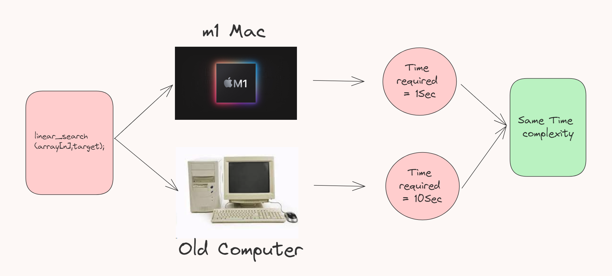
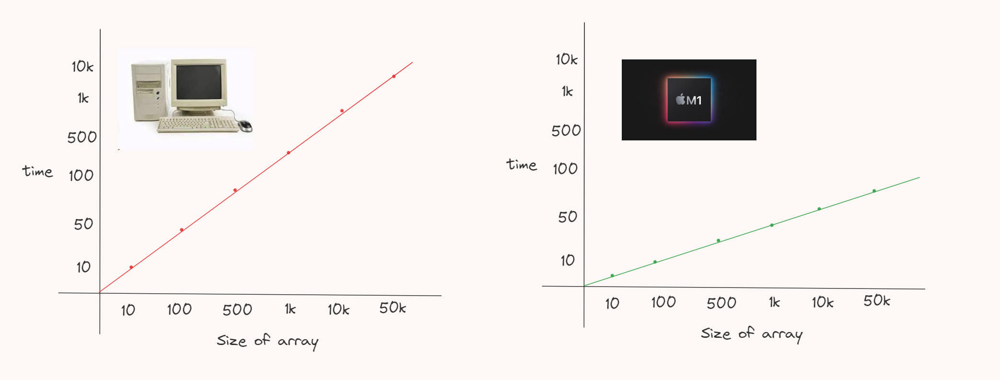
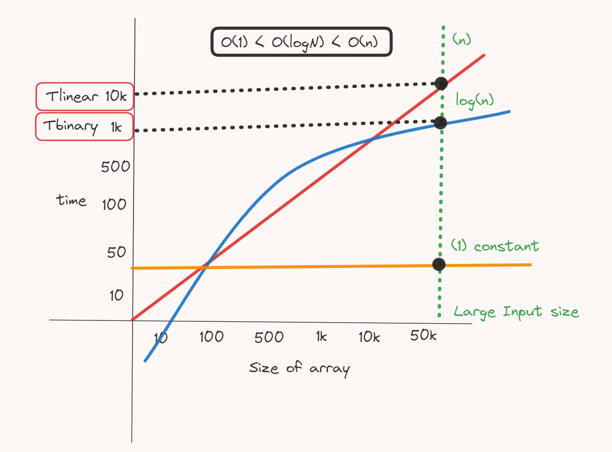
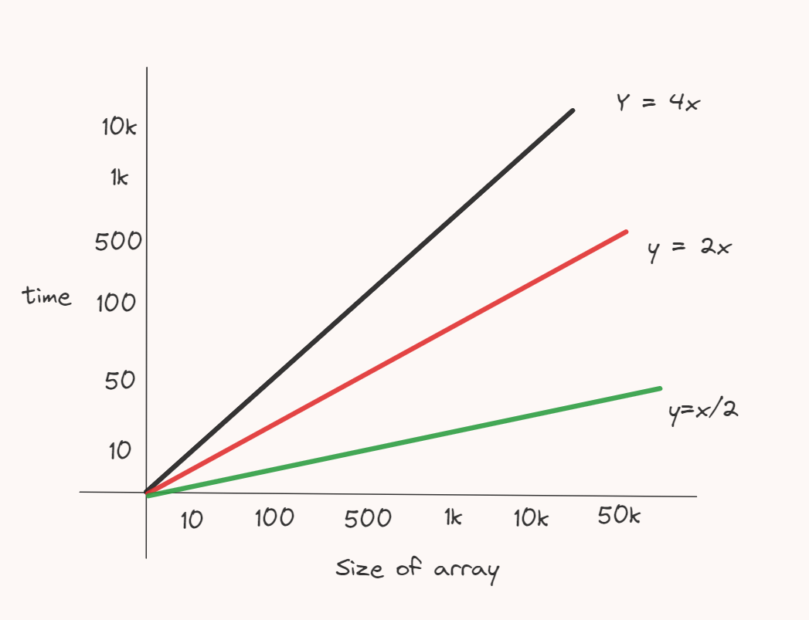
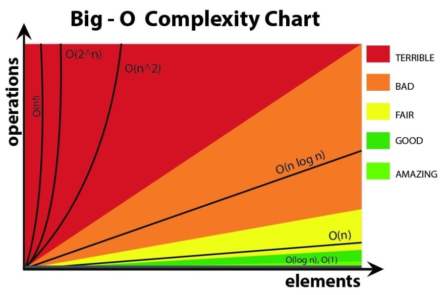
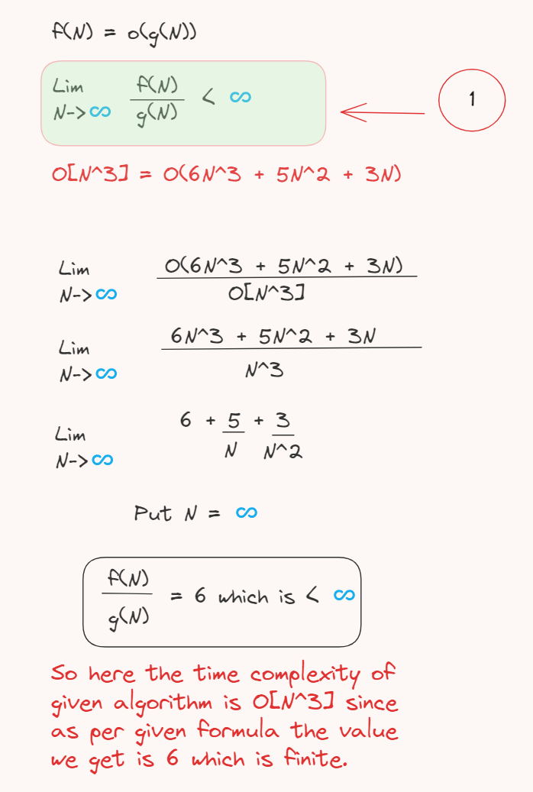
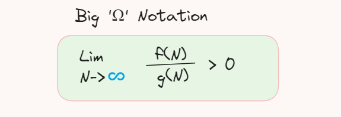
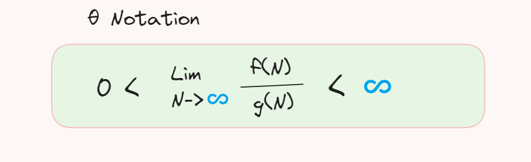
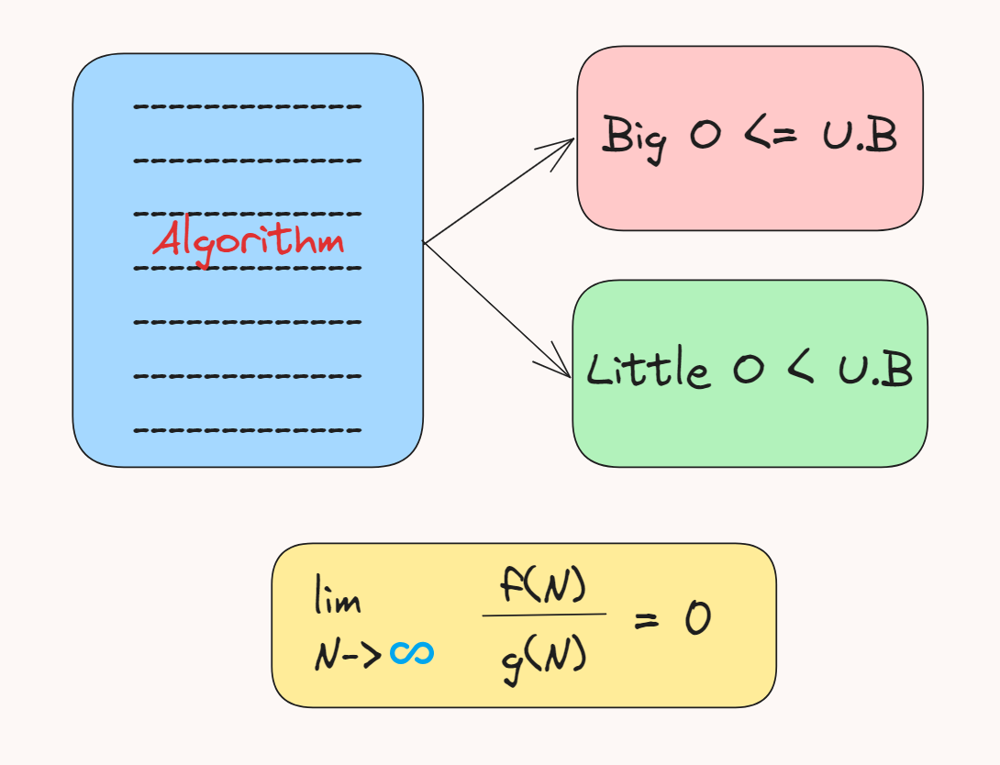

# Day_15 TimeComplexity_Analysis

<h2>What is Time Complexity?</h2>

First lets take an example here we run a linear search algorithm program on M1 mac and our old computer all the parameters for the given program is same in both devices but as M1 is new or advance it executed the program and display the output in 1Sec and on the other hand the old computer executed in 10Sec.

But time complexity for both of this devices is same only

<B>It is because the time complexity is Not a time required to execute a certain program</b>

<h3>Here now we plot the graph of time required to run the program vs the size of array</h3>

<h3>here we can see that the time vs arr.length both are linear graph so that the time complexity for both devices are same which is linear here time is linearly proportional to size of Input</h3>

<h2>Time Complexity 🕥 </h2>
<h3>Time complexity is Nothing but a function that gives us relationship between the execution time and size of input</h3>

<h2>Why time complexity Analysis is important?</h2>

It is important because in the programming world the time is actual a money means when a particular algorithm for higher size inputs taking so much time then that algorithm is not efficient to use so get to know such things we required time complexity analysis

Lets take an example of linear & binary search algorithm

binary search takes log(n) time complexit & on other hand linear search takes n. 

<h2>Points to remember while thinking about Time complexity</h2>
<ul type="square">
<li>Always look for worst case time complexity</li>
<li>Always look for time complexity for large/infinite data</li>
<li>In following graph there are 3 machines time complexity the green one is most powerfull machine and black one is least   But time complexity for all 3 machines is same which is Linear irrespective the slope <b>So due to this reason we neglate constants while calculating time complexity</b></li>

<li>Always ignore the less dominating terms</li>

</ul>

<h2>What Actually is a Big 'O' Notation?</h2>

O[X] here it tell us about the relationship between time & input size never exceeds X Were in place of X we can assume {N,N^2,N^3,LogN,...}

Example : Time complexity of AlgoA is O[N^3] means the N^3 is the upper bound for the relationship between time & input size

F(N) is the time complexity of the given algorithm if and only if it full fill the condition (1) in above image

<h2>What is a Big 'Ω' Notation?</h2>

Big Omega is nothing but the Opposite of Big 'O' Notation means as Big 'O' represents the Upper bound of the Time complexity of the particular algorithm similarly Big Omega denotes Lower Bound of the Time complexity

 Ω[N^3] means the the given algorithm has at least N^3 relationship between time & input size

<h2>What is a Theta 'θ' Notation</h2>

When we want to denote the time complexity of such a algorithm whose upper and lower bound both are equal to (N^2)

At this time we cannot denote it as O[N^2] & Ω[N^2]

So here we use θ Notation θ[N^2] which tells us about the time complexity of the particular algorithm is equal to N^2 means lower as well as upper bound equal to N^2

<h3>But in reality we only consider Big'O' notation because we are dealing with only the worst case time complexity</h3>

<h1>Little 'O' Notation</h1>

Little 'O' Notation is nothing but upper bound of any given algorithm but not strictly like big 'O'

<h1>Little 'Ω' Notation</h1>

Little Omega Notation also denotes the lower bound of any given algorithm but not strictly like big'Ω'

