# OOPS_lec1

<h1> Object Oriented Programming in Java!😃</h1>
<h2>Need of OOPS ❔</h2>
<p>Now if we want to store some collection of roll numbers of 5 students in program we use array of integer</p>

```
// to store the roll number of 5 student
int[] roll = new int[5]
```

<p>similary to store the names of 5 students we are using array of string</p>

```
// to store names of students
String[] names = new String[5];
```

<p>But suppose id we want to store this both student name and roll number in one entity called as student_info then we cannot do such thing in normal procedural programming</p>

<h3>And here comes concept of Classes & Objects.</h3>

<h2>What are Classes 🤔</h2>
<p>Classes are the named group of properties & functions.
By convention class name start with 'Capital' letter.</p>

<h2>Syntax of class 📄</h2>

```
class ClassName
{
    // declare different properties (variables)
    .....

    // declare different functions (methods)
    .....
}
```

<p>Now we try to make a student class to store the student information (name,roll)</p>

```
class Student
{
    int roll;
    String name;
}
```

<h2>What are Objects 🤔</h2>
<p>Objects are the instance of a class & Classes are the template for a object</p>

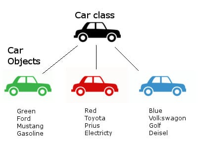
<p>Here in example we can see that the Car class is the generalise template for different cars.</p>
<p>Here we can observe that each car have some properties which are set by Car class the properties are like color,Brand,Name,Fuel type etc</p>
<p>But the value of each property for every car is different</p>


<h3>Classes does not have physical existance but Objects have thats why objects are instance of a class</h3>
<h3>Classes are generalise rule for object creation</h3>
<h3>Classes are the <mark>Logical Construct</mark></h3>
<h3>Objects are the <mark>Physical Reality</mark> Actually allocating space in memory</h3>
<h3>Objects shows following things uniquly : </h3>
<ul>
<li>State : Actual values from the variables</li>
<li>Identity : Uniqueness of object , object data store at different memory location </li>
<li>Behavour</li>
</ul>

<p>Objects are created in heap memory and there reference variable get stored inside the stack and each reference variable points to it's object in heap</p>

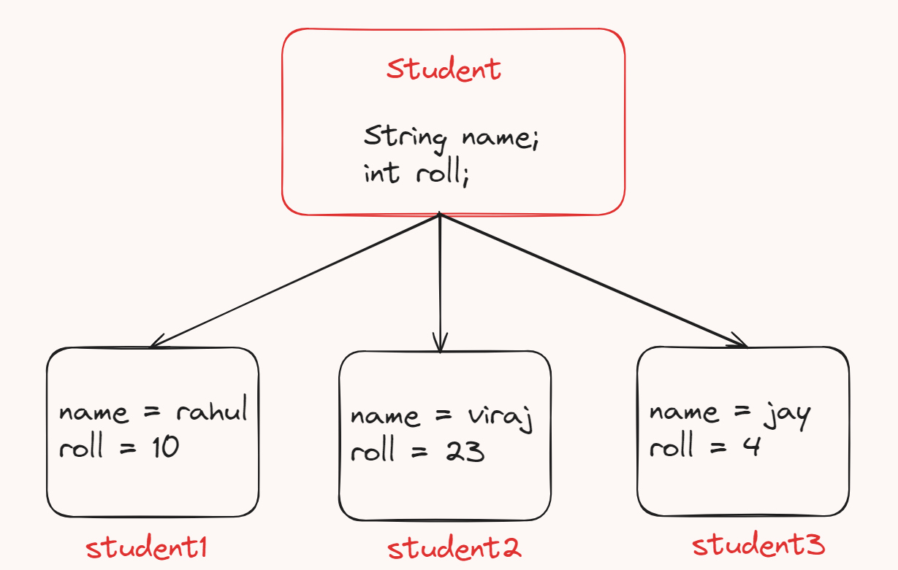

<p>Here we created multiple Object of class "Student" each object have different properties than other</p>

<h3>How to access the data from the object of a any particular class 🤔</h3>
<p>We are using '.' operator or "dot separator" to access the data from the particular object of any class</p>

```
// get name of student of object "student1"
name = student1.name;

// get roll number of "student2" object
roll = student2.roll;
```

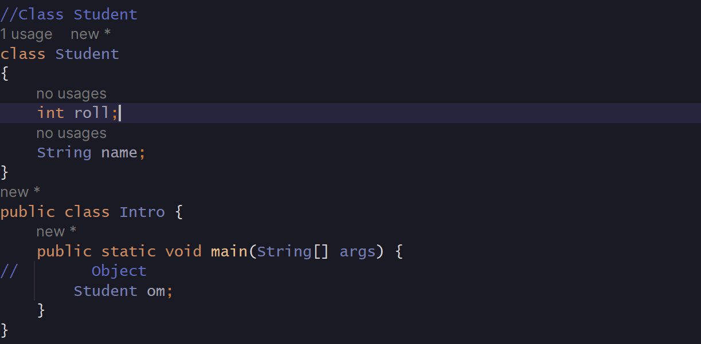

<p>Now lets try to access data from the object</p>

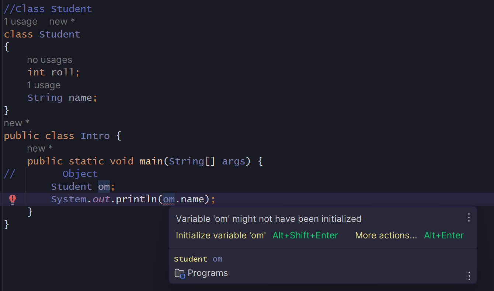
<p>The error is related to initialisation of object we are not intialising the object and try to fetch or access the data which is not present in it</p>
<p>So first we need to initialise the created object om</p>

<h3>Here comes "new" keyword in picture</h3>

<p>Before going for initalisation of object one question arises in mind 🧠 that what value the object poiniting when it is not initalise </p>

<p>So to know more about it we try to print the Array of object of class Student which are not initalise then the result we got is null </p>


<h3>Means all objects which are created but not initialised they originally pointing ot <mark>null</mark></h3>

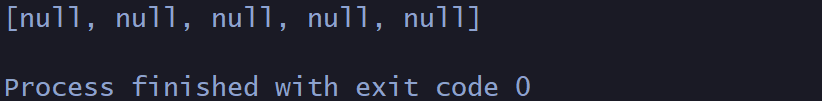

<h3>So now lets know how "new" keyword help us to initalise the object</h3>

<p>When we create object the reference variable is created inside stack but the object is not created in heap so it is initailly pointing to null</p>

<p>But now we initalise it using "new" keyword now the new keyword dynamically allocate the memory to the object in <mark>  Runtime </mark>and return the reference or address so that reference variable in this case "om" can point that created object</p>


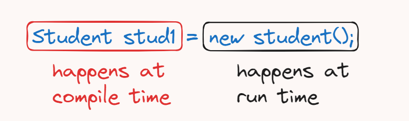

<h2>Default values of primitive data type in java</h2>

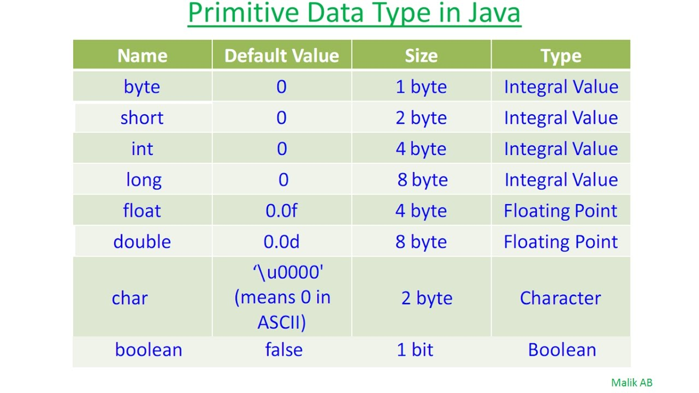

<h3>Default value of all types of Object is <mark> null </mark></h3>

<h2>Let's Initalise our Object and fill values in it's properties using dot operator and also try to fetch them 😃</h2>


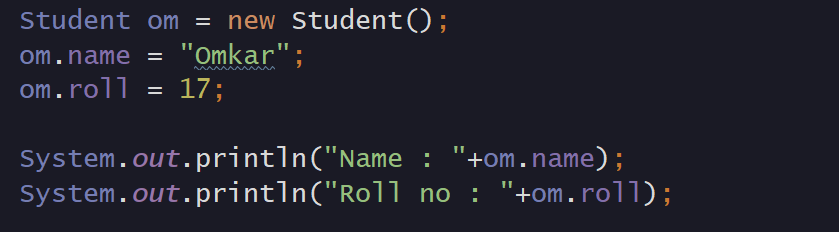

<h2>Our output 👍</h2>

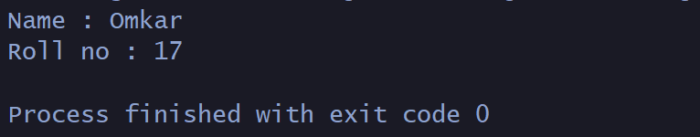

<h2>Lets know the internal working of all of this initalization of object</h2>


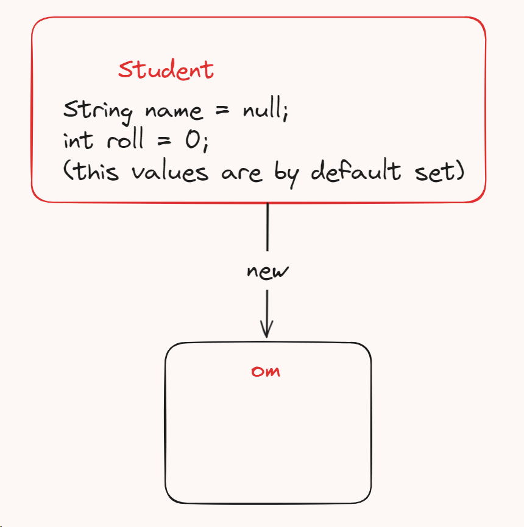

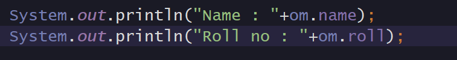

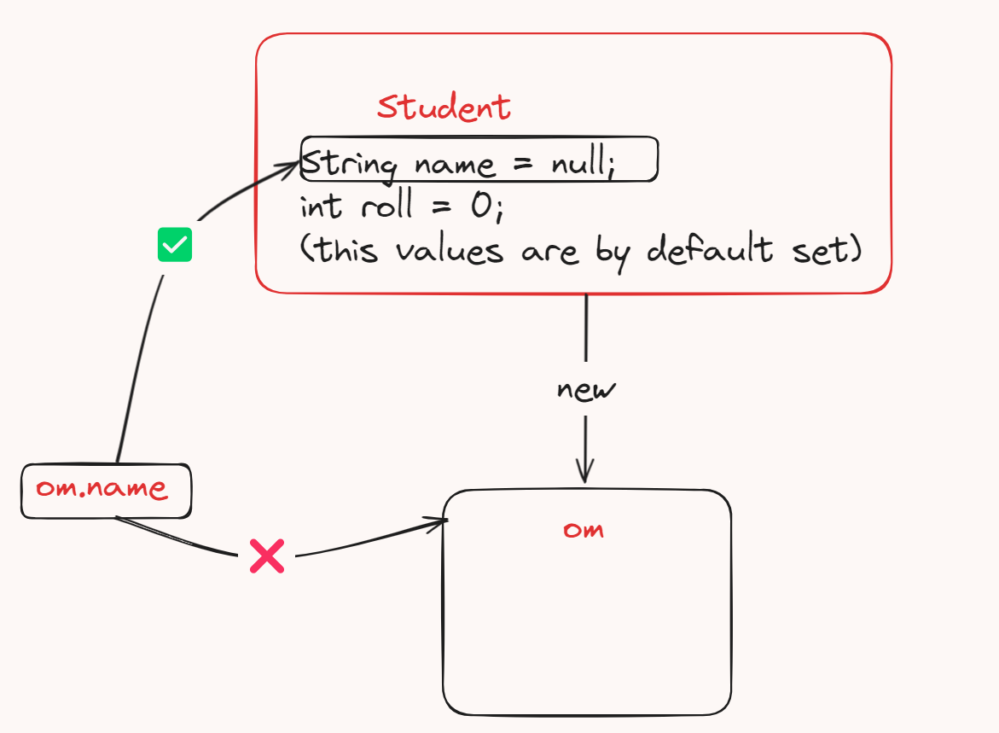


<h3>Now Lets initialise the name and roll of the object "om"</h3>


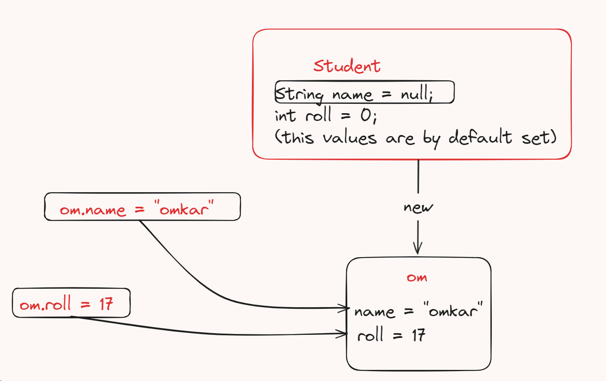

<h3>Now again try to fetch the value</h3>


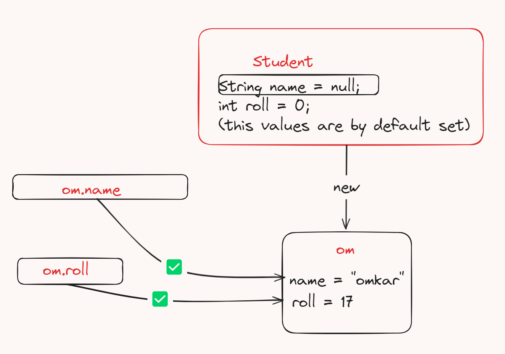

<h3>And yes we got our values 😁</h3>

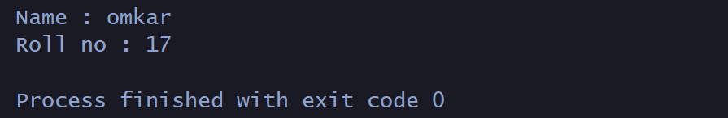

<h3>Now there is one more question arises that if suppose a object have more than 50 properties then the method of declaration of properties value is getting so slow and time consuming</h3>

<h3>So to solve this problem <mark> Constructor </mark> came in picture</h3>

<h2>What is Constructor 🏗️ 🤔</h2>
<p>Constructor is nothing but a method which actually runs automatically when a instance of a class created in other words it is the thing which defines what happen when a instance of a class or a object of a class intialised</p>

<h3>The most important application of the Constructor is to instantiate the object of the class or initialise the object of the class</h3>

<h3>Or also to initialise the properties of a object</h3>

<h3>Constructor is nothing but a Builder 👷‍♂️ for a object it helps to Build 🏗️ the object</h3>

<h3>Physically constructor is the function inside the Class which name is same as class name</h3>


<h3>The highlighted part of code is the constructor.Actually it is a default constructor which is call when we do not create our constructor for a particular class</h3>

<h2>How to create a constructor to initialise the object properties</h2>

```
Class Student{

    int roll;
    String name;

    Student(int roll,String name)
    {
        this.roll = roll;
        this.name = name;
    }

}
```

<h3>Constructor not required any return type because <mark> By default return type of constructor is the Class it self</mark></h3>


<h3>Now one more question arises what is "this" keyword 🤔</h3>

<p>If we initialise a properties of "om" object like following way we get error since class is the generalised template for the object the "om" is unknown for a Class or similarly for the constructor</p>

<p>So to handle this error we use "this" keyword "this" keyword help us to point the refernece variable of that particular object which is going to initialise</p>

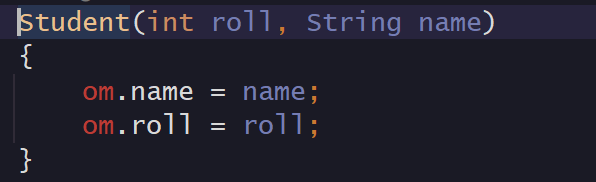

<p>so "this" keyword points the "om" reference variable in stack</p>

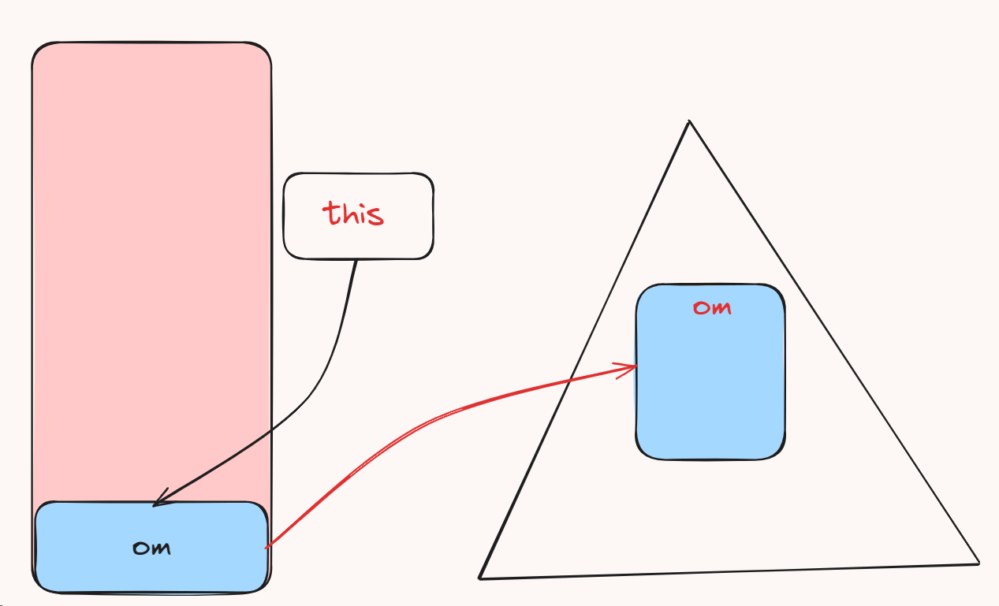

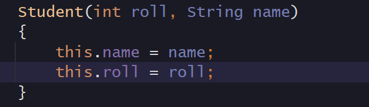

<h3>Initialisation of properties values without using "this" variable</h3>

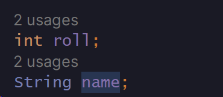

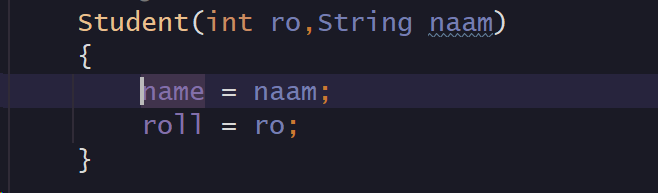

<h3>Here we can do this only becaues the parameter names of the constructor is different than the property name of the class.</h3>

<h2>Copy Constructor</h2>
<p>Copy Constructor is the special type of constructor which is use to build the object by copying properties of another object passed as a parameter</p>

<h3>Syntax of Copy Constructor</h3>

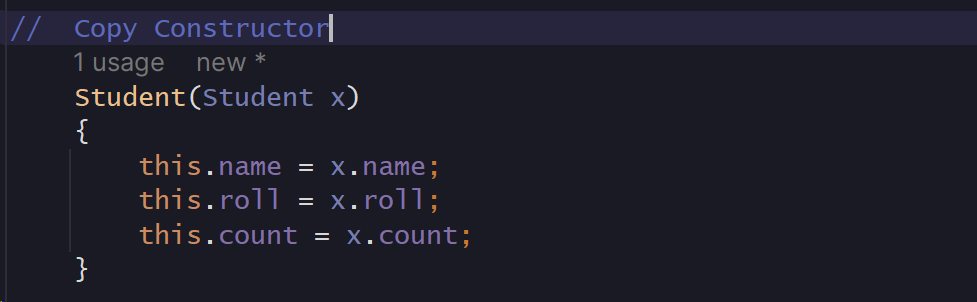

<h3>Object initialization using normal constructor</h3>


<h3>Creating Copy of previous object using Copy Constructor</h3>

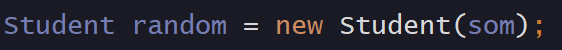

<h3>Verifying by fetching values from new copy object </h3>

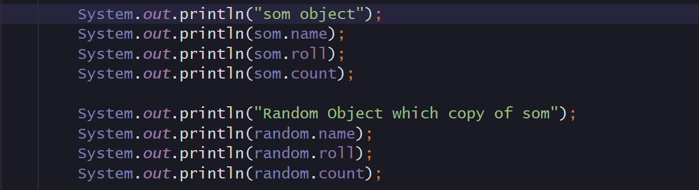

<h3>Output 😁👍</h3>

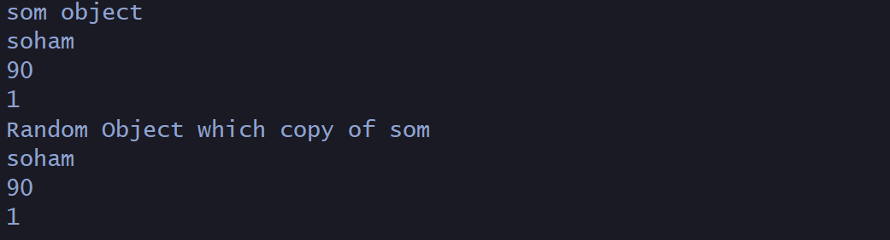

<h2>"this" keyword use to call constructor inside another constructor</h2>

```
 Student(int roll, String name)
    {
        this.name = name;
        this.roll = roll;
        this.count = counter++;

    }

Student()
    {
        this(10,"Default Person");
    }
```


<h2>Why we not use "new" keyword while initialising the primitive datatypes in java 🤔</h2>
<p>As we know in Java Primitives are not Objects and the primitive datatypes like int,char,bool,float etc are store inside stack memory not in heap and memory allocation of the primitive datatype is done at compile time only</p>
<p>So they are not Object so they do not required "new" keyword to initialise</p>
<p>They are treated as normal variable, reason behind this is to increase efficiency of the java programs since if normal primitives becomes object it will more time consuming and inefficient to execute simple programs which are created using this primitives</p>


<h2>Creating Copy of Object</h2>

```
Student one = new Student();
Student two = one;
```

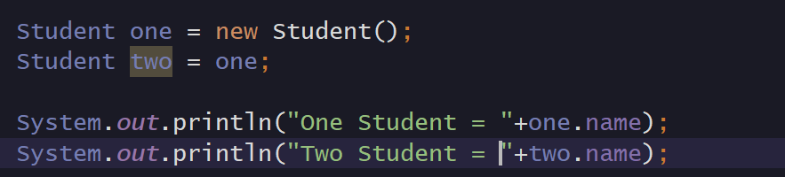

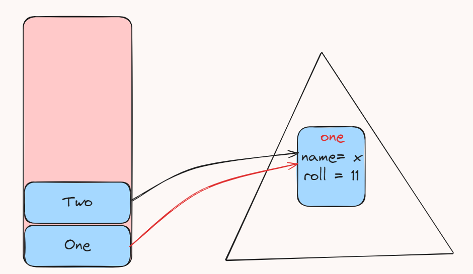


<p>If we change the value of "name" property of object "Two" this change will also reflect in Object "One" Property</p>

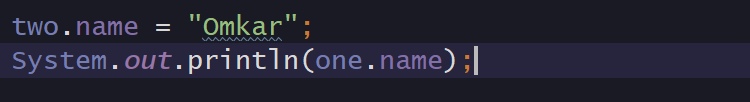

<h3>Output 😁</h3>


<h2>Swap program using function in Java 🤔</h2>

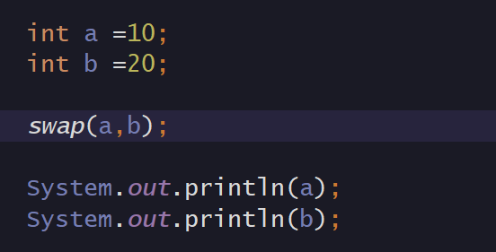

<h3> Function : </h3>

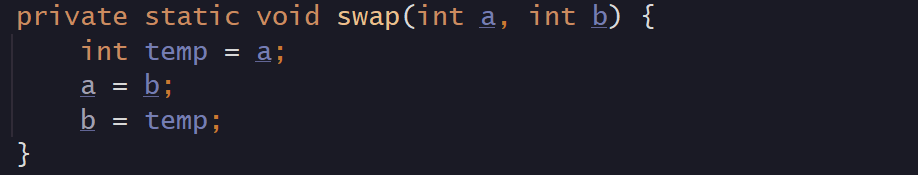

<h3> Output </h3>

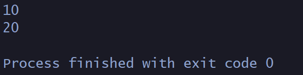
<h3>Yes numbers are not swapped because in Java Pass by reference is not available here we only pass parameter using pass by value</h3>

<p>Here in function the a & b are having local scope so they swapped locally</p>

<h2>Final variable</h2>
<p>Final variables are once initialised variable which can not be further modified or reinitialise in the given program</p>
<p>We should always initialse while declaring it</p>
<p>final variables only of primitive datatypes have the feature of immutability</p>

```
final int a = 10;

a = 20; ❌
```

<p>But if we assign a Class Object as a final then we can change the properties value of that object but we cannot reinitialise that particular object of that class</p>

```
final Student om = new Student();

om.name = "Omkar" ✅ // can change the value of any property of object

Student som = new Student();
om = som; ❌ // cannot reinitialise the object
```

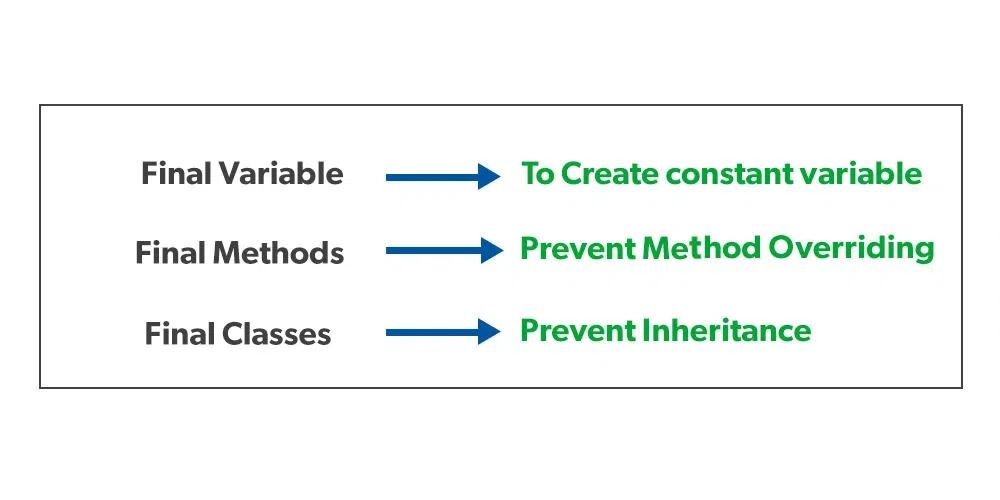

<h2>Garbage Collector🗑️</h2>
<p>Java have inbuilt garbage collector which clean the memory frequently after some time</p>
<p>Java not have a Destructer which help to delete or remove the created object from the heap memory</p>
<p>But java have finalize() method which is use to perform some action when we delete any object</p>
<p>It acts completely opposite to constructer</p>

```
class Student
{
    String name;
    int roll; 

    Student(int roll,String name)
    {
        this.roll = roll;
        this.name = name;
    }

    @Override
    protected void finalize() throws Throwable {
        System.out.println("The Object is deleted Successfully");
    }
}
```

<p>the finalise function automatically called when garbage collector cleans the memory there is no need of calling it externally</p>


