# OOPS_lec2

<h2>Pakages in Java 📁</h2>

Packages are nothing but folders in which java files are present

Packages in java help us to organise the java programs in very efficient way

Packages comprises with different Classes or Interfaces and the Classes/Interfaces inside packages are unique

Means if one package contains the class named as "Hello" then we cannot create a same class inside that particular package

Most important and useful application of the packages are they provide functionality which help us to use one class object in any other class by simply importing it in the present class

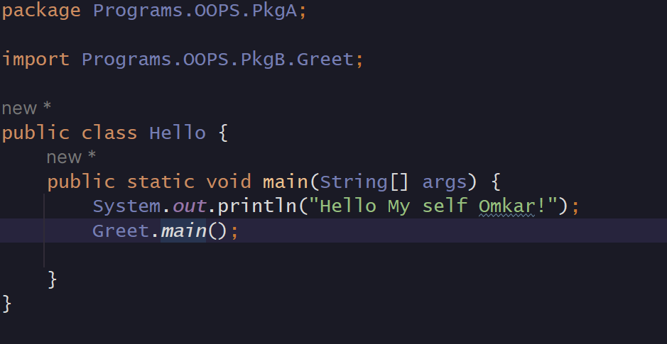

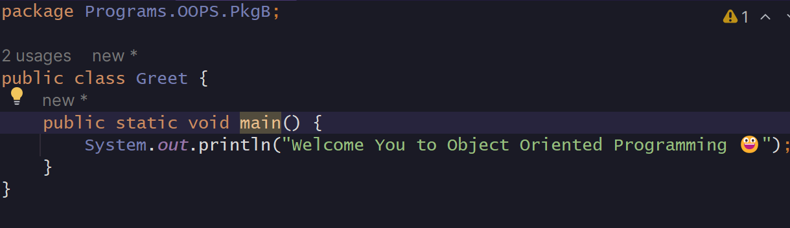

<h2>Output 😁</h2>

<h3>Here in above example how we can efficiently access Greet class from PkgB inside Hello Class present inside PkgA this feature are provided by packages </h3>

<h3>You also Noticed that we mention package name/location on the top of every program it is only for compiler to locate the position of the particular class</h3>

<h3>If two classes are in same package then there is no need to use "import" statement instead we can directly use them</h3>

<h3> Types of Packages in Java 🤔</h3>

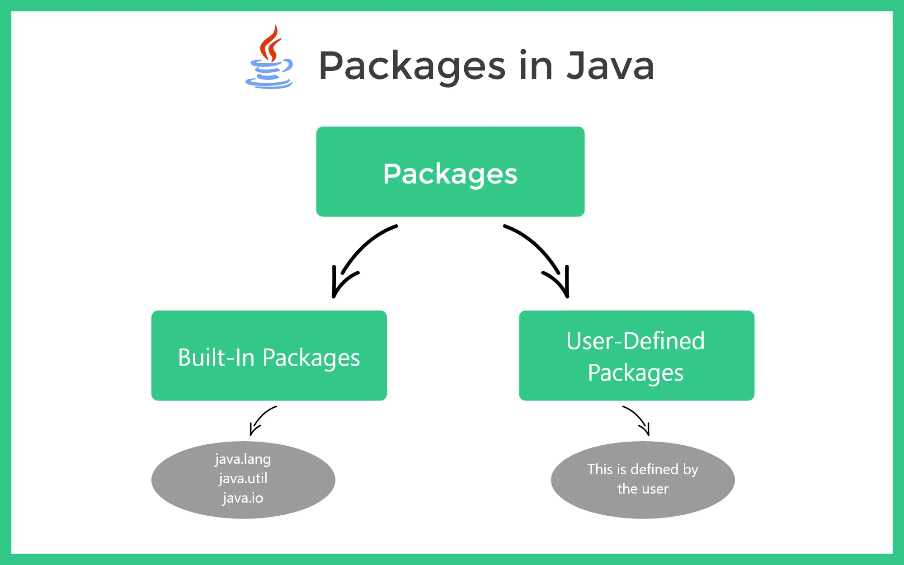

<h2>What is "static" keyword 🤔</h2>

"Static" keyword is use to declare some variable/properties & functions of the particular class as static

Static variables/Methods are the independent variables and methods means they are not depend upon the object for all object there values/functionality is same 

<h2>What is the need of "static" Variables/Methods in classes</h2>

There is a simple example which explains this very clearly :

Let's Create a class name Human with some properties like age,name,salary,married & gender etc

Now lets create a Main class to create a objects of the Human class in the same package

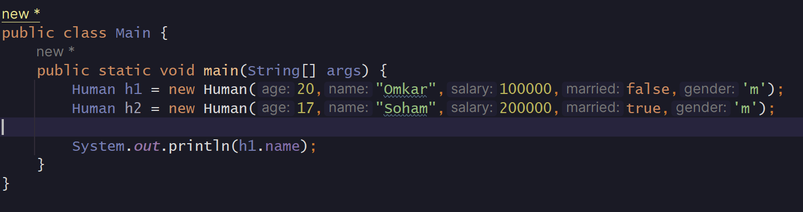

Here we create 2 objects one is h1 and another is h2 after that we notice that the all properties inside the Human class which we created are related to particular objects means in short all objects have unique values for this properties

But we know there are some properties or functions which are common for all Human class irrespective of Object

The Properties like Population of world , Planet they are living etc. And they also have some common functions like Walking,Inhaling,Jumping,Eating etc which are common in all Human class objects and there values are also same for all

<h3>So to create those properties or methods which do not change as per instance of the class changes we require "static" keyword</h3>

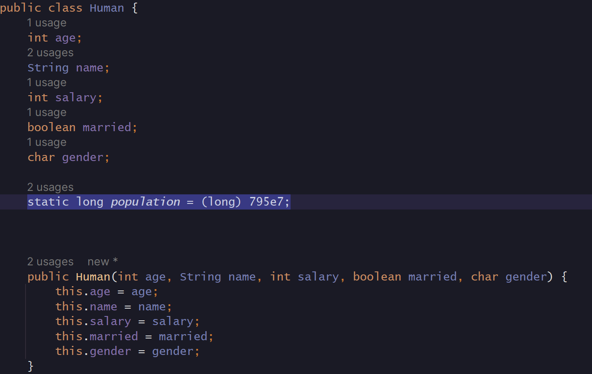

Here we add population property inside the Human class which is static which value remains constant for all objects of human class

As we can see the value of population is set same for all objects

<h3>Lets see how to access & modify the "static" variables 👀 </h3>

Static variable is access by the object name as well as Class name but the convertion is to <mark> Access Static Variable Using Class Name </mark>

Also while Modifying the static variable in using Constructor we should use the <mark> Class Name</mark> only.

Here "this" keyword is also works to modify the static variables but here also the convention is to use Class Name

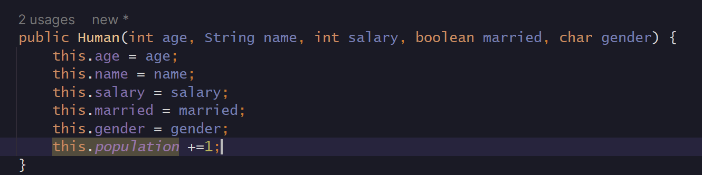

When we use "this" keyword it showing us a warning.But it modify the static property

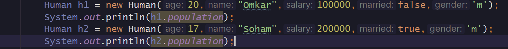

But we use "Class Name" to modify the static variable

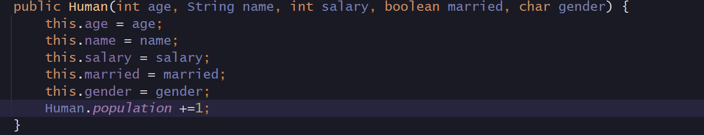

Now we can see the when we use "Class name" instead of "this" key word compiler stop showing warning

And it also working properly 😃

<h3>So always use Class Name to access and modify the static variables as per convention</h3>

<h2>Now one question should arise in our mind that how "this" keyword modify the static variable value errorlessly 🤔</h2>

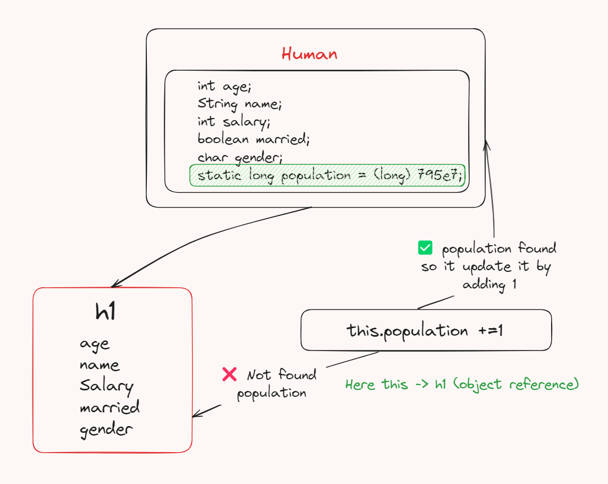

We already know when we use "this" keyword in constructor to modify the properties values the this keyword first point to the reference variable of the particular object which is initialised

Similarly here also it points to the object "h1" but in object "h1" it unable to find the population property and we know that from the previous lecture when "this" keyword not get any reference of a particular property in pointed object then it checkout for the same property in the Class

Similarly if it not get population property in "h1" object then it checks that property in "Human" class and it found population property in that class so it update or modify it by adding 1 in it, At this time "this" pointing to the "Human" class

So modifying the static variable using "this" keyword is like 

<h3>😃 Fun Fact is that Static variables as well as functions are do not require any object to access them we can directly access them using class name only</h3>

<h3>"Static" keyword help to perform Procedural Programming in java we can literally use them without creating objects for a that particular class</h3>

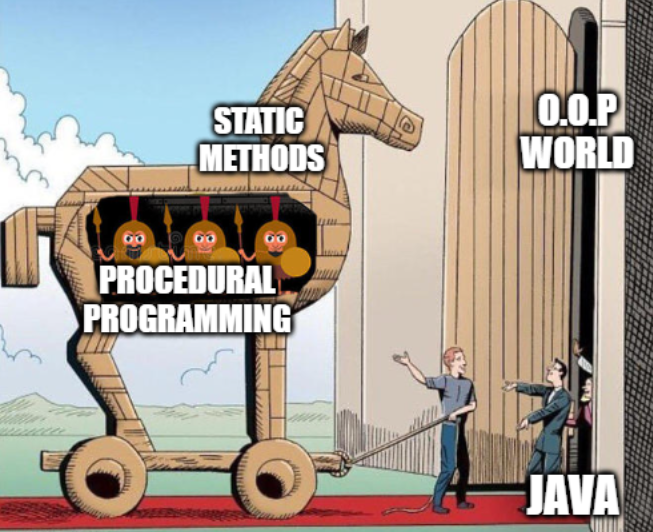

<h2>Why we declare the "main" method as static method 🤔</h2>

We declare "main" method as static because we know that the "main" method is the most important method without main method we cannot even run our program

If the main method is not static then to run or access it we always need to create an object or instance for a particular class and then we can run it

So to run it without creating any sort of object we declare main method as "static" so programmer can run the program without creating a object for it.

<h3>⭐ Static methods / Properties are belong to Class not to Object of that class</h3>

<h3>We cannot access or call non static variables or methods inside the static methods 🤯
</h3>

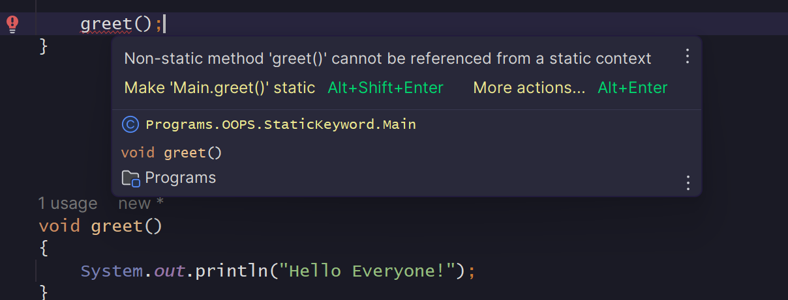

If we do it static then we access it inside static method

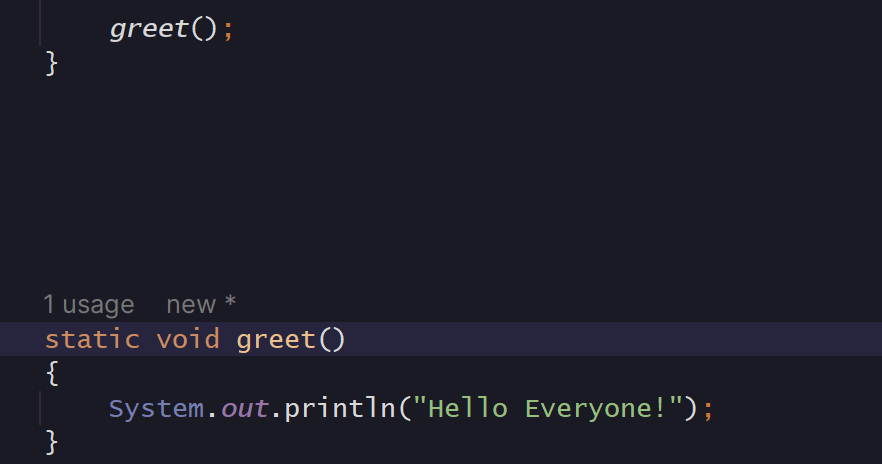

<h3>Why this is so 🤔</h3>

As we know the any static method shows that I am independent of objects but all non static methods or variables are dependent on objects they require the instance of the class to access them but a static method doesn't require any such instance

So when a non static method is called inside the static method non static method demands a instance to call itself but static method do not have such instance so due to this reason we cannot call non static method inside the static method but vise versa is possible
 

<h3>We can access non static methods or variable inside the non static methods because to call the non static method we need to create an instance and when inside non static we call another non static then it also demand for instance then the reference of the previous one is pass to this non static method or variable</h3>

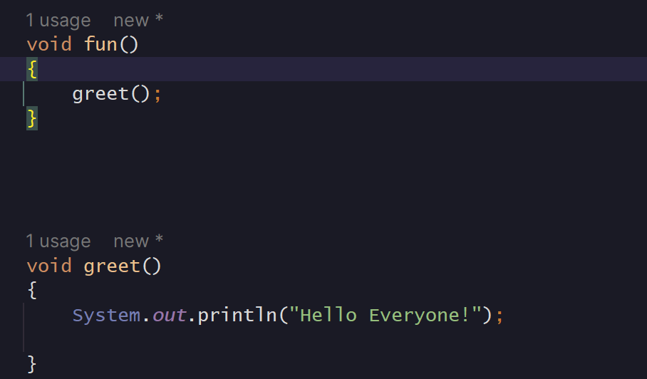

<h3>Here we can see the obj1 reference which is first pass to fun() and then pass to greet() to run it</h3>

<h3>In static function inside class we cannot access non static variable even if we are using "this" keyword</h3>

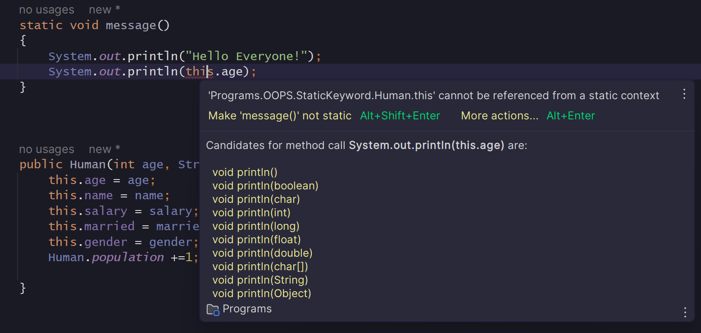

<h2>What is Static Block & how static variables behaves 🤔</h2>

We create a static block in which we can write code which is static in nature means it do not require any object or instance to run

<h3>The fun 😃 fact is that all the code inside static block only runs once when the class is loaded for the first time.</h3>

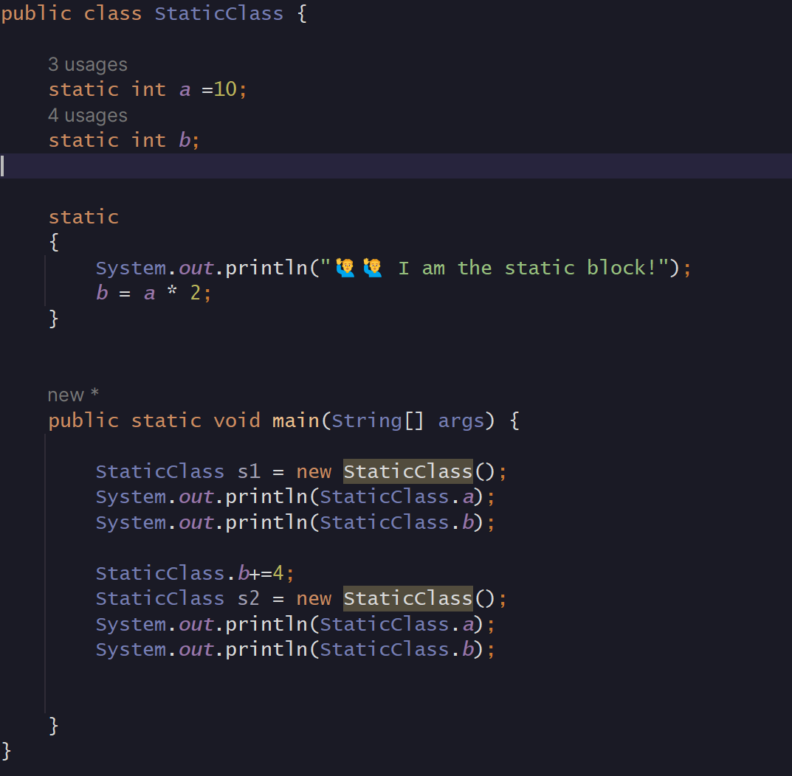

<h3>Output 🤯</h3>

In by observing code and output we can easily get that the code inside the static block runs only ones when the first object of the class is created

<h3>So the best application of the static block is to initialise some important parameters of class or to display some message or alert.When class is loaded first etc</h3>

<h2>What is Inner Class 🤔</h2>

Inner class is nothing but a class inside the other class.

If your inner class is not static then to create the object of the inner class you required the object of the outer class

But if you declare the inner class as the static then your inner class is independent of the outer class object

So you can directly create new object of that class without creating object of the outer class

<h3>Here we can see the inner class named as "TestClass" is not static so we cannot create object of that class inside the main function.</h3>

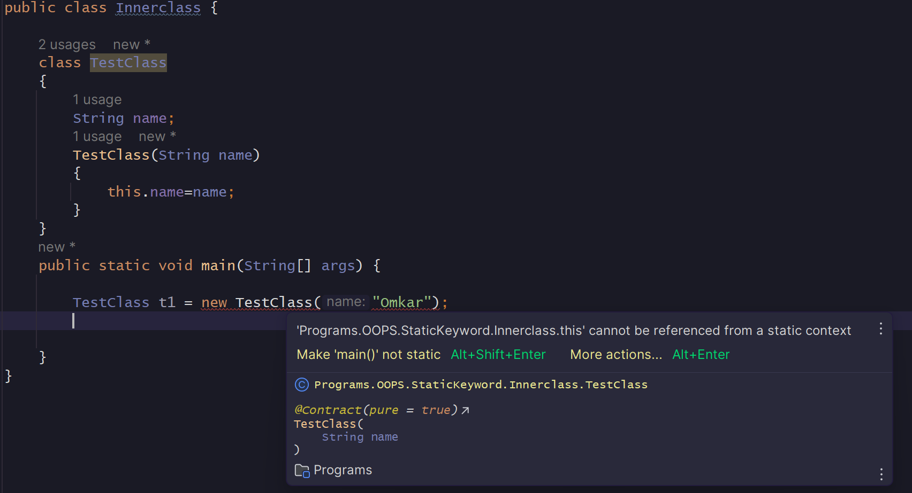

<h3>Now we convert TestClass to static so we can create object inside the main function</h3>

<h3>Here we know that the class is nothing but a builtin datatype created by us so it work as it's original property means it can create objects still it is static.</h3>
<h3>Static is in the sense that the TestClass do not require Object of the InnerClass to create it's own object here it is just like other classes not like a Inner class </h3>

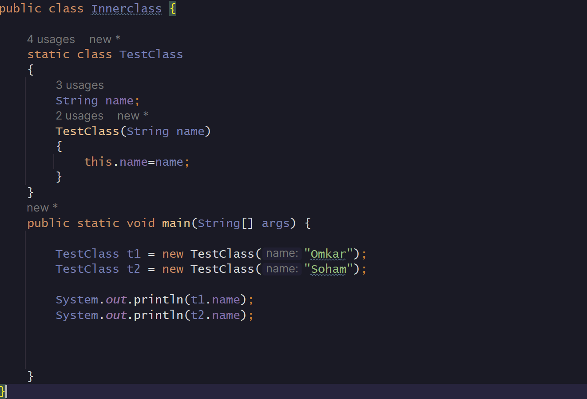

<h3>🌟 All static methods / variables are not related to object so they resolved at compile time only</h3>

<h2>toString() method 🤔</h2>

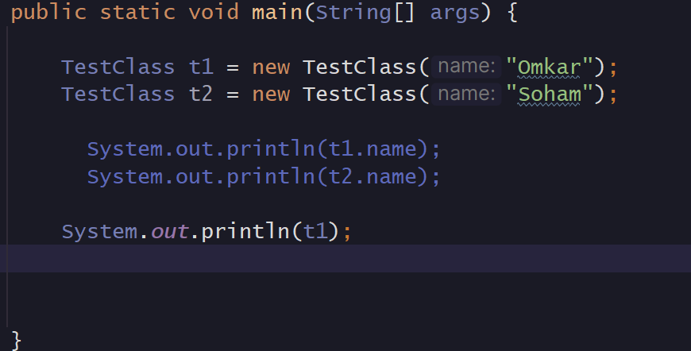

<h3>Output 😃</h3>

<h3>Here we can see the if we print the object using println function the println function toString() method inside the object if it not finds the toString() method inside the object then it prints the hash value of that particular object</h3>

<h3>But if we declare the toString() method inside the Class then the println call that method and print the content inside it</h3>

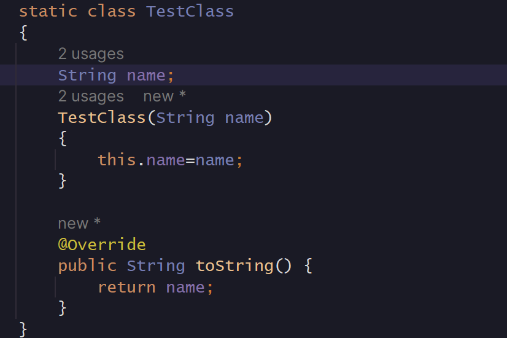

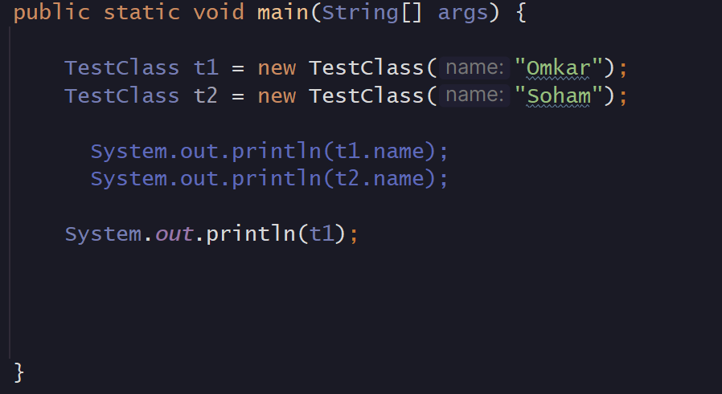

<h3>Output 😃</h2>

Here we can created toString() method inside the class so when we println the object t1 it return the name property of that object which is "omkar"

<h2>What is Singleton Class 🤔</h2>

Singleton class is the class which only allow to create one instance only means class which can have only one Object

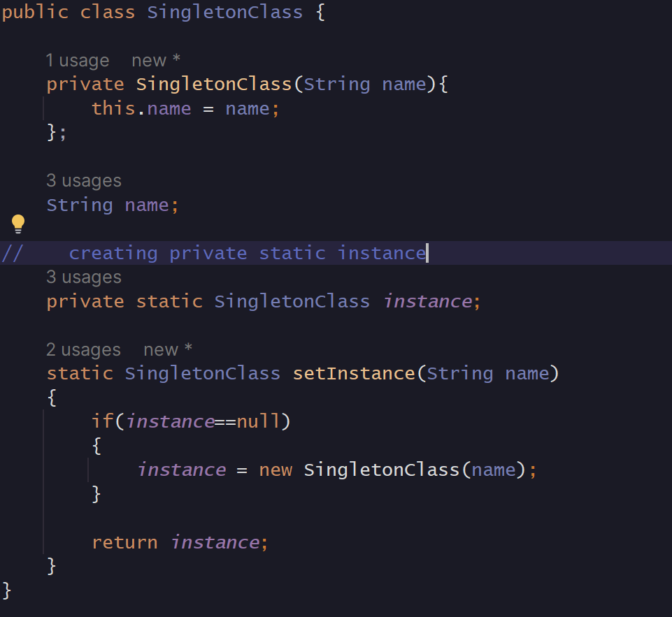

Here we make the constructor private so anybody outside the class do access the constructor it indirectly means that anybody outside the class cannot create the object of the class

Here we create a static instance which is also private and also create the modified constructor like function which takes track that object is created once or not if the object is created once it return that same object

If the object is null then it initialise that object using private constructor inside the class only

In main function if we create multiple object but all reference variable of the created object pointing towards the single object which is created first

<h3>So this types of Classes are known as Singleton class</h3>

