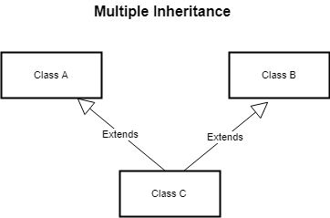
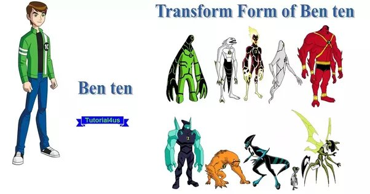

# OOPS_lec3

<h2>Piilars of Object Oriented Programming</h2>


<h2>Inheritance 👨‍👩‍👧‍👦 </h2>
<p>Classes (Child) inheriting properties of Other (Parent/Base) class this feature of of the OOPS is known as Inheritance</p>

<h3>Child Class 👶</h3>
<p>Class which access or inherite the property of parent or based class</p>

<h3>Parent Class 👨‍👩</h3>
<p>Parent class or the based class consist all the properties and methods which are further get accessed or inherite by the child class</p>

<h3>We use <b>"extends"</b> keyword to create the child class which inherite the properties of the parent class</h3>

<h3>Syntax</h3>

```
class Parent
{
    //properties
    //methods
}

class Child extends Parent
{
    //properties
    //methods
}
```

<h3>Child class can have there own properties and methods but it can access the properties and methods of parent class</h3>


<h3>While Initialising the Object of the child class we need to initialise the variables or properties of child as well as parent class</h3>


<h3>Here we can see when we create a Human and Insect class constructor to initialise the variables of respective class we also take the Base Class variables like name,age & properties into consideration</h3>

<h3>Normal OOPS</h3>

```
public class Box {
    double h;
    double l;
    double w;

//    Default
    Box()
    {
        this.l=-1;
        this.w=-1;
        this.h=-1;
    }

//    Cube
    Box(double side)
    {
        this.l=side;
        this.h=side;
        this.w=side;
    }

//    Cuboid
    Box(double l,double w,double h)
    {
        this.l=l;
        this.w=w;
        this.h=h;
    }

    void info()
    {
        System.out.println("This object is of Default Box class");
    }

    public static void main(String[] args) {
        Box box = new Box();
        Box box1 = new Box(4.5);
        Box box2 = new Box(4.5,3.5,5.5);

        System.out.println("Box = H : "+box.h+" L : "+box.l+" W : "+box.w);
        System.out.println("Box1 = H : "+box1.h+" L : "+box1.l+" W : "+box1.w);
        System.out.println("Box2 = H : "+box2.h+" L : "+box2.l+" W : "+box2.w);

    }
}
```

<h3>We define the Box class and assign it some properties like Height,Length & Width and also construct it's object by using different constructor</h3>


<h3>Now we create two child classes by extending Box Class one is Cube another one is Cuboid</h3>

<h4>Cube have Properties : (From Parent) => Height,Width & Length (Own) => Weight</h4>

<h4>Cuboid have Properties : (From Parent) => Height,Width & Length (Own) => Weight,Color</h4>

<h3>As we know we need to create a constructor for this child classes so we create constructors inside Cube as well as Cuboid class</h3>
<h3>Cube Constructor</h3>


<h3>Cuboid Constructor</h3>


<h3>Now in above code you must observe that along with the Cube and Cuboid own properties we also need to initalise the properties came up with the inheritance from the parent or base class known as Box class</h3>

<h3>Above is the one way of initialising parent class properties inside the child class</h3>
<h3>Another way by using <b>"Super"</b> keyword</h3>

<h2>Super 🦸‍♂️</h2>
<p>Super keyword is use to call the constructor of parent class or base class from the child class.</p>

<h3>Using Super Keyword</h3>


<h3>super(side) call</h3>


<h3>super(l,w,h) call</h3>


<h3>Object or Instance of Parent class unable to access the child class properties but vise versa possible </h3>

<h3>What happen when we reference a subclass or child class object with the base class or superclass 🤔</h3>


<h3>Here we can see that when we create object of subclass with reference of superclass it access only those variables or properties which are present in superclass it unable to access the properties of subclass which are it's own properties just like "weight" in this given example</h3> 

<h3>Now lets try to do exactly opposite means creating a object of parent class with Child class as reference</h3>


<h3>Here we are facing error because as we are creating a parent class object by referencing child class it means we can access all the varibles of the child class</h3>

<h3>But to access the variables of child class "Cube" we must required to initialise it here weight it the child class property which cannot be accesible by parent class and parent class unable to use child class constructor so it fails to initialise weight so as all variables of the child class are not get initialised the object is not get created</h3>

<hr>
<h2>Lets Understand Super 🦸‍♂️ Keyword in depth </h2>


<h3>Here we can see how the super keyword calls the parent class constructor when use it</h3>
<h3>But when we use super keyword in parent class itself the super keyword call the constructor of Object class</h3>
<h3>As we know Object Class is the parent class of all classes in java</h3>

<h3>Super Keyword is also use to access the variables as well as methods present inside the superclass or parent class 😃</h3>

<h3>Following example shows : </h3>


<h3>Parentclass Box</h3>


<h3>Childclass Cube</h3>


<h3>Output 😃</h3>


<h3>We always initialise parent class properties first After that we initialise class properties</h3>
<h3>Subclass do care of which properties are contain by superclass due to this superclass variables first get initialised and after that subclass variables get initalised in the constructor</h3>

❌❌❌❌

✅✅✅✅


<h3>This is important because it ensures that the parent class is initialized before the child class. If the child class constructor does not call the parent class constructor, the parent class will not be initialized and the child class may not work properly.</h3>

<h3>⭐When we do not initialise the properties of the parent class by any of two ways then it direclty call the default constructor of the parent class first and after that it further initialise the child class variables</h3>


<hr>
<h2>Types of Inheritance</h2>
<h3>1️⃣ Single Inheritance</h3>    
<h4>One Class Extends Another</h4>


<h3>2️⃣ Multilevel Inheritance</h3>
<h4>Parent class have a child class and that child class is acted as parent another child class</h4>


<h3>Below or lower classes have all the information of above classes similarly above class not have an information of below classes</h3>

<h3>3️⃣ Multiple Inheritance</h3>
<h4>One class extend from more than one class means here child class has 2 parent classes it inherite the properties of both classes</h4>


<h4>Here we can see the Child class have 2 Parent class or Child class is extends from 2 parent class and both parent class have same variable or property but have different value</h4>

<h4>Parent 1 have n = 5 and Parent 2 have n = 10 so when we create an object of child class and try to access the value of "n" variable now ambiguity is created that which value of n is to be choose by child class</h4>

<h3>Due to this ambiguity the multiple inheritance Not Allowed in JAVA </h3>

<h3>But to Implement this in JAVA we are using Interfaces, Interfaces are nothing but classes but without values they are only template of classes means all struture of properties and methods are define inside the interface but it's actual values are not given means initialization not done in interfaces</h3>



<h3>4️⃣ Hierarchical Inheritance</h3>
<h4>One Parent class Inherite multiple child classes</h4>
<h4>All properties are same as Single Level Inherietance</h4>


<h3>5️⃣ Hybrid Inheritance</h3>
<h4>Combination of Single and Multiple Inheritance and as we know JAVA do not support Multiple Inheritance due to this it also not support Hybrid Inheritance</h4>
<h4>Hybrid Inheritance is also implemented using Interfaces</h4>


<hr>
<br>
<h2>Polymorphism </h2>


<h3>Polymorphism is nothing but it is the many ways to represent one single entity</h3>

<h3>Some amazing Examples</h3>




<h2>Types of Polymorphism</h2>
<h3>1️⃣ Compile Time Polymorphism / Static Polymorphism</h3>
<h3>2️⃣ Run Time Polymorphism / Dynamic Polymorphism</h3>

<h3>Compile Time or Static Polymorphism</h3>
<h4>It is achive by method overloading</h4>
<h4>Method Overloading is nothing But</h4>
<ul>
<li>Same Name of Method</li>
<li>Different Return Type</li>
<li>Different Parameter Type</li>
<li>Different Parameter Count</li>
<li>Different Parameter Ordering</li>
</ul>

<h3>Example 😀</h3>
<h4>Different Types of Construtors name is same but different parameters, Ordering and data type of arguments</h4>
<ol>
<li>Default Constructor</li>
<li>All variable Initialiser Constructor</li>
<li>Copy Constructor</li>
</ol>


